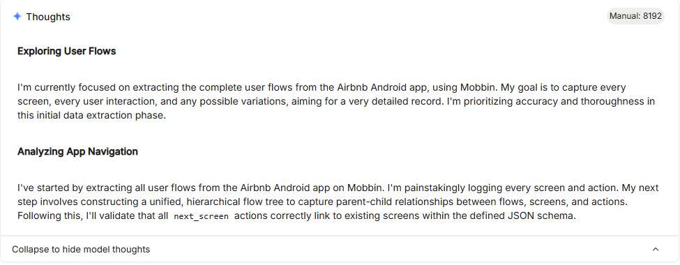

# Design Specification Automation System


##  Summary

The **Design Specs Automation System** is an AI-powered design specification assistant that automates the process of competitive analysis and UX flow design for Android applications. The system leverages Google's Gemini AI models to analyze competitor apps, extract screen flows, and generate production-ready app flow trees based on best UX practices for the final design specification document generation.

### Key Value Proposition
- **Automated Competitive Intelligence**: Identifies top 10 competitor apps with 100K+ downloads
- **Screen Flow Extraction**: Analyzes competitor UX patterns from verified sources (Mobbin platform) and the web authentic sources as fallback
- **AI-Driven Flow Design**: Generates complete, hierarchical app flow trees for new products
- **Time Savings**: Reduces weeks of manual research to minutes of automated analysis

---

##System Architecture

### Technology Stack

| Component | Technology | | Purpose |
|-----------|-----------|---------|---------|
| **Frontend** | Streamlit || Web-based UI with dark glassmorphic theme |
| **AI Engine** | Google Gemini | 2.5-Flash & 2.5-Pro | Competitive analysis & flow generation |
| **PDF Processing** | PyPDF2 | | PRD document parsing |
| **Environment** | Python | | Runtime environment |
| **Config Management** | python-dotenv | | API key management |

### Core Components

```
┌─────────────────────────────────────────────────────────────┐
│                    Streamlit Web Interface                   │
│                        (app.py)                              │
└────────────────────────┬────────────────────────────────────┘
                         │
                         ▼
┌─────────────────────────────────────────────────────────────┐
│                  Pipeline Orchestrator                       │
│                      (main.py)                               │
│  ┌──────────────────────────────────────────────────────┐  │
│  │ Step 1: Competitive Analysis (competitive_analysis.py)│  │
│  │         ↓                                              │  │
│  │ Step 2: Extract App Names                             │  │
│  │         ↓                                              │  │
│  │ Step 3: Screen Flow Extraction (flow_tree_service.py) │  │
│  │         ↓                                              │  │
│  │ Step 4: App Flow Tree Generation (app_flow.py)        │  │
│  └──────────────────────────────────────────────────────┘  │
└─────────────────────────────────────────────────────────────┘
                         │
                         ▼
┌─────────────────────────────────────────────────────────────┐
│                   Google Gemini API                          │
│  • Gemini 2.5-Flash (Competitive Analysis)                  │
│  • Gemini 2.5-Pro (Flow Generation)                         │
│  • Advanced Reasoning (8192 token thinking budget)          │
│  • Google Search Integration                                │
└─────────────────────────────────────────────────────────────┘
```

---

## 🔄 System Workflow

### Phase 1: User Input Collection
**Interface:** Streamlit Web UI  
**Inputs Required:**
1. **App Name** - Name of the target application
2. **App Description** - Brief description of app purpose and features
3. **PRD Document** - PDF upload (optional for future enhancements)


### Phase 2: Competitive Analysis
**Module:** `competitive_analysis.py`  
**AI Model:** Gemini 2.5-Flash  
**Process:**
1. Analyzes app description to determine market category
2. Searches authoritative sources (Google Play Store, data.ai, Sensor Tower, SimilarWeb)
3. Applies Chain-of-Thought (CoT) reasoning for similarity evaluation
4. Filters apps with <100K downloads
5. Returns exactly 10 unique competitor apps

**Output Schema:**
```json
{
  "apps": [
    {
      "app_name": "Official App Name",
      "estimated_download_count": 1000000
    }
  ]
}
```
**Prompt Engineering Techniques Used**

| Technique | Description |
|------------|--------------|
| **Chain-of-Thought (CoT)** | Instructs the model to internally reason step-by-step to assess functional and semantic similarity between apps. |
| **Step-back Reasoning** | Directs the model to reassess borderline or uncertain cases for higher accuracy and reliability. |
| **Role Prompting** | Defines the model’s persona as a “world-class Android app market research specialist” to anchor expertise and domain tone. |

**Advanced Features:**
- Thinking budget: 8192 tokens for deep reasoning
- Deduplication by package ID and app name


### Phase 3: Screen Flow Extraction
**Module:** `flow_tree_service.py`  
**AI Model:** Gemini 2.5-Pro  
**Data Source:** Mobbin platform (UX flow repository) and Web

**Process:**
1. Searches each competitor app on Mobbin if available or the web
2. Navigates to Flows section
3. Extracts complete flow trees (unified or individual flows)
4. Captures every screen, user action, and transition
5. Validates structural integrity (no broken links, no dead ends)

**Output Schema:**
```json
{
  "apps_screen_flows": [
    {
      "app_name": "string",
      "app_screen_flows": [
        {
          "flow_name": "string",
          "screens": [
            {
              "screen_name": "string",
              "actions": [
                {
                  "user_action": "string",
                  "next_screen": "string"
                }
              ]
            }
          ]
        }
      ]
    }
  ]
}
```

**Prompt Engineering Techniques Used**

| Technique | Description |
|------------|--------------|
| **Chain-of-Thought (CoT)** | Encourages structured, multi-step internal reasoning to accurately extract and validate complete app flow trees. |
| **Few-shot Prompting** | Provides illustrative examples (e.g., partial Instagram flow) to guide the model’s output structure and style. |
| **Role Prompting** | Defines the model’s persona as a “Senior Mobile UX Research Analyst and Product Flow Architect” to ensure domain expertise and consistency. |


**Quality Assurance:**
- Every flow has ≥1 screen
- Every screen has ≥1 action
- All transitions are valid and resolvable
- No hallucinated or inferred flows


### Phase 4: Custom App Flow Tree Generation
**Module:** `app_flow.py`  
**AI Model:** Gemini 2.5-Pro with Google Search  
**Reasoning Technique:** Tree-of-Thought Expansion

**Process:**
1. **Deep Understanding**: Extracts core value proposition from app description
2. **Competitor Analysis**: Identifies common UX patterns and differentiation opportunities
3. **Flow Synthesis**: Explores 3-5 alternative flow paths per user goal
4. **Validation**: Ensures hierarchical completeness and UX best practices
5. **Output**: Production-ready flow tree in strict JSON format

**Output Schema:**
```json
{
  "app_flow_tree": {
    "app_name": "string",
    "based_on_competitors": ["app1", "app2", ...],
    "app_screen_flows": [
      {
        "flow_name": "string",
        "screens": [
          {
            "screen_name": "string",
            "actions": [
              {
                "user_action": "string",
                "next_screen": "string"
              }
            ]
          }
        ]
      }
    ]
  }
}
```
**Prompt Engineering Techniques Used**
| Technique | Description |
|------------|--------------|
| **Chain-of-Thought (CoT)** | Guides the model through structured multi-phase internal reasoning (Understanding → Analysis → Synthesis → Validation → Output) for coherent and logical flow generation. |
| **Tree-of-Thought (ToT)** | Expands reasoning by exploring multiple alternative flow paths before selecting the most optimal one, ensuring creativity and depth in UX structure design. |
| **Role Prompting** | Assigns the model a precise expert persona — “Senior Mobile UX Flow Architect and Product Designer” — to align reasoning, tone, and output with domain expertise. |

**UX Principles Applied:**
- Consistent navigation patterns
- Discoverability and retention
- Minimal cognitive load

---

## 💡 Key Features & Capabilities

### 1. Intelligent Competitive Analysis
- **Market Research Automation**: Identifies functionally similar apps across global markets
- **Data Verification**: Cross-references multiple authoritative sources
- **Download Threshold**: Filters for apps with proven market traction (100K+ downloads)
- **Uniqueness Guarantee**: Deduplicates by package ID and official name

### 2. Advanced AI Reasoning
- **Chain-of-Thought (CoT)**: Breaks down similarity evaluation step-by-step
- **Step-Back Reasoning**: Double-checks borderline cases
- **Thinking Budget**: 8192 tokens allocated for deep analysis
- **Tree-of-Thought**: Explores multiple flow alternatives before selection

### 3. Comprehensive Flow Extraction
- **Source Priority**: Mobbin platform as primary verified source
- **Hierarchical Structure**: Maintains flow → screen → action → next_screen hierarchy
- **Completeness**: Captures entire user journey breadth-wise and depth-wise
- **Validation**: Structural and semantic checks ensure data integrity

### 4. Production-Ready Output
- **Strict JSON Schema**: Ensures downstream system compatibility
- **Hierarchical Completeness**: Every transition explicitly defined
- **UX Best Practices**: Incorporates industry-standard patterns
- **Downloadable Results**: JSON exports for all analysis stages

### 5. Modern User Interface
- **Dark Glassmorphic Theme**: Professional gradient design (purple-blue spectrum)
- **Real-Time Progress**: Visual feedback during processing
- **Expandable Sections**: Organized display of complex JSON data
- **Summary Statistics**: Quick insights (total flows, screens, competitor count)
- **Download Options**: Separate exports for competitors, flows, and app tree

---

## 📊 Output Deliverables

### 1. Competitor Apps Report
- List of 10 verified competitor apps
- Official app names
- Estimated download counts
- Formatted display with download metrics

### 2. Competitor Screen Flows
- Complete flow trees for all 10 competitors
- Screen-by-screen navigation paths
- User actions and transitions
- Summary statistics (total apps analyzed, total flows)

### 3. Custom App Flow Tree
- Production-ready hierarchical flow structure
- Based on competitor insights + unique app features
- Complete user journey mapping
- Summary: main flows, total screens, competitor basis

### 4. Downloadable JSON Files
- `competitor_apps.json` - Competitive analysis results
- `competitor_screen_flows.json` - Extracted flow data
- `app_flow_tree.json` - Generated custom flow tree

---

## 🔧 Technical Implementation Details

### API Integration
- **Google Gemini API**: Requires `GEMINI_API_KEY` in `.env` file
- **Model Selection**:
  - Gemini 2.5-Flash: Fast competitive analysis
  - Gemini 2.5-Pro: Complex flow generation with search capabilities
- **Streaming Output**: Real-time response processing with `io.StringIO`

### Data Processing Pipeline
```python
# Pipeline Flow (main.py)
1. generate_similar_apps(app_description)
   → Returns: {"apps": [...]}
   
2. extract_app_names(similar_apps_data)
   → Returns: ["App1", "App2", ...]
   
3. generate_screen_flows(app_names)
   → Returns: {"apps_screen_flows": [...]}
   
4. generate_flow_tree(app_name, app_description, screen_flows)
   → Returns: {"app_flow_tree": {...}}
```

### Session State Management
```python
# Streamlit session state variables
- pdf_text: Extracted PDF content
- competitor_data: Competitive analysis results
- screen_flows: Competitor flow trees
- app_names: Extracted app name list
- app_flow_tree: Generated custom flow
- processing_complete: Pipeline status flag
```

---

**Sample Input for Demo:**

App Name: WealthNest
App Description: WealthNest is a next-gen finance android app that helps users build financial stability by automatically analyzing income, expenses, and habits to create personalized savings and investment plans — all within a simple, intuitive interface.


Output:
[text](../../Downloads/competitor_apps.json)
[text](../../Downloads/competitor_screen_flows.json)
[text](../../Downloads/wealthnest_flow_tree.json)

```
App Name: FitGenius AI
App Description: An AI-powered fitness tracking app that creates 
personalized workout plans based on user goals, fitness level, and 
available equipment. Features include real-time form correction using 
phone camera, nutrition tracking, progress analytics, and social 
challenges with friends.
```

---

## Identifying if the flow tree service works accurately reflecting the apps real flows

We test it out on a specific app (e.g Airbnb) and then manually verify the output against the app's official flow.


Output:
[text](../../Downloads/ai_studio_code.txt)

Verifying against mobbins flow tree main listing it covers all the main flows and screens.

## Conclusion

The Design Specs Automation System represents a significant advancement in automated design specification and competitive analysis. By combining Google's cutting-edge AI models with verified UX data sources, the system delivers production-ready insights in minutes rather than weeks of research.


