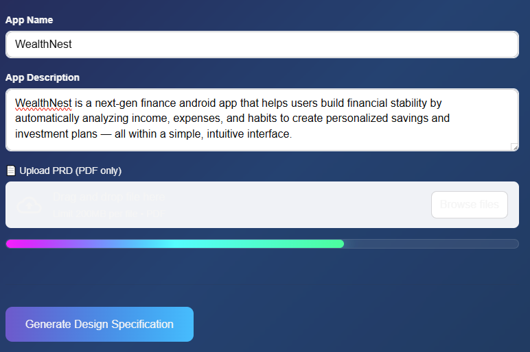

# Design Specification Automation System


##  Summary

The **Design Specs Automation System** is an AI-powered design specification assistant that automates the process of competitive analysis and UX flow design for Android applications. The system leverages Google's Gemini AI models to analyze competitor apps, extract screen flows, and generate production-ready app flow trees based on best UX practices for the final design specification document generation.

### Key Value Proposition
- **Automated Competitive Intelligence**: Identifies top 10 competitor apps with 100K+ downloads
- **Screen Flow Extraction**: Analyzes competitor UX patterns from verified sources (Mobbin platform) and the web authentic sources as fallback
- **AI-Driven Flow Design**: Generates complete, hierarchical app flow trees for new products
- **Time Savings**: Reduces weeks of manual research to minutes of automated analysis

---

##System Architecture

### Technology Stack

| Component | Technology | | Purpose |
|-----------|-----------|---------|---------|
| **Frontend** | Streamlit || Web-based UI with dark glassmorphic theme |
| **AI Engine** | Google Gemini | 2.5-Flash & 2.5-Pro | Competitive analysis & flow generation |
| **PDF Processing** | PyPDF2 | | PRD document parsing |
| **Environment** | Python | | Runtime environment |
| **Config Management** | python-dotenv | | API key management |

### Core Components

```
┌─────────────────────────────────────────────────────────────┐
│                    Streamlit Web Interface                   │
│                        (app.py)                              │
└────────────────────────┬────────────────────────────────────┘
                         │
                         ▼
┌─────────────────────────────────────────────────────────────┐
│                  Pipeline Orchestrator                       │
│                      (main.py)                               │
│  ┌──────────────────────────────────────────────────────┐  │
│  │ Step 1: Competitive Analysis (competitive_analysis.py)│  │
│  │         ↓                                              │  │
│  │ Step 2: Extract App Names                             │  │
│  │         ↓                                              │  │
│  │ Step 3: Screen Flow Extraction (flow_tree_service.py) │  │
│  │         ↓                                              │  │
│  │ Step 4: App Flow Tree Generation (app_flow.py)        │  │
│  └──────────────────────────────────────────────────────┘  │
└─────────────────────────────────────────────────────────────┘
                         │
                         ▼
┌─────────────────────────────────────────────────────────────┐
│                   Google Gemini API                          │
│  • Gemini 2.5-Flash (Competitive Analysis)                  │
│  • Gemini 2.5-Pro (Flow Generation)                         │
│  • Advanced Reasoning (8192 token thinking budget)          │
│  • Google Search Integration                                │
└─────────────────────────────────────────────────────────────┘
```

---

## 🔄 System Workflow

### Phase 1: User Input Collection
**Interface:** Streamlit Web UI  
**Inputs Required:**
1. **App Name** - Name of the target application
2. **App Description** - Brief description of app purpose and features
3. **PRD Document** - PDF upload (optional for future enhancements)


### Phase 2: Competitive Analysis
**Module:** `competitive_analysis.py`  
**AI Model:** Gemini 2.5-Flash  
**Process:**
1. Analyzes app description to determine market category
2. Searches authoritative sources (Google Play Store, data.ai, Sensor Tower, SimilarWeb)
3. Applies Chain-of-Thought (CoT) reasoning for similarity evaluation
4. Filters apps with <100K downloads
5. Returns exactly 10 unique competitor apps

**Output Schema:**
```json
{
  "apps": [
    {
      "app_name": "Official App Name",
      "estimated_download_count": 1000000
    }
  ]
}
```
**Prompt Engineering Techniques Used**

| Technique | Description |
|------------|--------------|
| **Chain-of-Thought (CoT)** | Instructs the model to internally reason step-by-step to assess functional and semantic similarity between apps. |
| **Step-back Reasoning** | Directs the model to reassess borderline or uncertain cases for higher accuracy and reliability. |
| **Role Prompting** | Defines the model’s persona as a “world-class Android app market research specialist” to anchor expertise and domain tone. |

**Advanced Features:**
- Thinking budget: 8192 tokens for deep reasoning
- Deduplication by package ID and app name


### Phase 3: Screen Flow Extraction
**Module:** `flow_tree_service.py`  
**AI Model:** Gemini 2.5-Pro  
**Data Source:** Mobbin platform (UX flow repository) and Web

**Process:**
1. Searches each competitor app on Mobbin if available or the web
2. Navigates to Flows section
3. Extracts complete flow trees (unified or individual flows)
4. Captures every screen, user action, and transition
5. Validates structural integrity (no broken links, no dead ends)

**Output Schema:**
```json
{
  "apps_screen_flows": [
    {
      "app_name": "string",
      "app_screen_flows": [
        {
          "flow_name": "string",
          "screens": [
            {
              "screen_name": "string",
              "actions": [
                {
                  "user_action": "string",
                  "next_screen": "string"
                }
              ]
            }
          ]
        }
      ]
    }
  ]
}
```

**Prompt Engineering Techniques Used**

| Technique | Description |
|------------|--------------|
| **Chain-of-Thought (CoT)** | Encourages structured, multi-step internal reasoning to accurately extract and validate complete app flow trees. |
| **Few-shot Prompting** | Provides illustrative examples (e.g., partial Instagram flow) to guide the model’s output structure and style. |
| **Role Prompting** | Defines the model’s persona as a “Senior Mobile UX Research Analyst and Product Flow Architect” to ensure domain expertise and consistency. |


**Quality Assurance:**
- Every flow has ≥1 screen
- Every screen has ≥1 action
- All transitions are valid and resolvable
- No hallucinated or inferred flows


### Phase 4: Custom App Flow Tree Generation
**Module:** `app_flow.py`  
**AI Model:** Gemini 2.5-Pro with Google Search  
**Reasoning Technique:** Tree-of-Thought Expansion

**Process:**
1. **Deep Understanding**: Extracts core value proposition from app description
2. **Competitor Analysis**: Identifies common UX patterns and differentiation opportunities
3. **Flow Synthesis**: Explores 3-5 alternative flow paths per user goal
4. **Validation**: Ensures hierarchical completeness and UX best practices
5. **Output**: Production-ready flow tree in strict JSON format

**Output Schema:**
```json
{
  "app_flow_tree": {
    "app_name": "string",
    "based_on_competitors": ["app1", "app2", ...],
    "app_screen_flows": [
      {
        "flow_name": "string",
        "screens": [
          {
            "screen_name": "string",
            "actions": [
              {
                "user_action": "string",
                "next_screen": "string"
              }
            ]
          }
        ]
      }
    ]
  }
}
```
**Prompt Engineering Techniques Used**
| Technique | Description |
|------------|--------------|
| **Chain-of-Thought (CoT)** | Guides the model through structured multi-phase internal reasoning (Understanding → Analysis → Synthesis → Validation → Output) for coherent and logical flow generation. |
| **Tree-of-Thought (ToT)** | Expands reasoning by exploring multiple alternative flow paths before selecting the most optimal one, ensuring creativity and depth in UX structure design. |
| **Role Prompting** | Assigns the model a precise expert persona — “Senior Mobile UX Flow Architect and Product Designer” — to align reasoning, tone, and output with domain expertise. |

**UX Principles Applied:**
- Consistent navigation patterns
- Discoverability and retention
- Minimal cognitive load

---

## Key Features & Capabilities

### 1. Intelligent Competitive Analysis
- **Market Research Automation**: Identifies functionally similar apps across global markets
- **Data Verification**: Cross-references multiple authoritative sources
- **Download Threshold**: Filters for apps with proven market traction (100K+ downloads)
- **Uniqueness Guarantee**: Deduplicates by package ID and official name

### 2. Advanced AI Reasoning
- **Chain-of-Thought (CoT)**: Breaks down similarity evaluation step-by-step
- **Step-Back Reasoning**: Double-checks borderline cases
- **Thinking Budget**: 8192 tokens allocated for deep analysis
- **Tree-of-Thought**: Explores multiple flow alternatives before selection

### 3. Comprehensive Flow Extraction
- **Source Priority**: Mobbin platform as primary verified source
- **Hierarchical Structure**: Maintains flow → screen → action → next_screen hierarchy
- **Completeness**: Captures entire user journey breadth-wise and depth-wise
- **Validation**: Structural and semantic checks ensure data integrity

### 4. Production-Ready Output
- **Strict JSON Schema**: Ensures downstream system compatibility
- **Hierarchical Completeness**: Every transition explicitly defined
- **UX Best Practices**: Incorporates industry-standard patterns
- **Downloadable Results**: JSON exports for all analysis stages

### 5. Modern User Interface
- **Dark Glassmorphic Theme**: Professional gradient design (purple-blue spectrum)
- **Real-Time Progress**: Visual feedback during processing
- **Expandable Sections**: Organized display of complex JSON data
- **Summary Statistics**: Quick insights (total flows, screens, competitor count)
- **Download Options**: Separate exports for competitors, flows, and app tree

---

## Output Deliverables

### 1. Competitor Apps Report
- List of 10 verified competitor apps
- Official app names
- Estimated download counts
- Formatted display with download metrics

### 2. Competitor Screen Flows
- Complete flow trees for all 10 competitors
- Screen-by-screen navigation paths
- User actions and transitions
- Summary statistics (total apps analyzed, total flows)

### 3. Custom App Flow Tree
- Production-ready hierarchical flow structure
- Based on competitor insights + unique app features
- Complete user journey mapping
- Summary: main flows, total screens, competitor basis

### 4. Downloadable JSON Files
- `competitor_apps.json` - Competitive analysis results
- `competitor_screen_flows.json` - Extracted flow data
- `app_flow_tree.json` - Generated custom flow tree

---

## 🔧 Technical Implementation Details

### API Integration
- **Google Gemini API**: Requires `GEMINI_API_KEY` in `.env` file
- **Model Selection**:
  - Gemini 2.5-Flash: Fast competitive analysis
  - Gemini 2.5-Pro: Complex flow generation with search capabilities
- **Streaming Output**: Real-time response processing with `io.StringIO`

### Data Processing Pipeline
```python
# Pipeline Flow (main.py)
1. generate_similar_apps(app_description)
   → Returns: {"apps": [...]}
   
2. extract_app_names(similar_apps_data)
   → Returns: ["App1", "App2", ...]
   
3. generate_screen_flows(app_names)
   → Returns: {"apps_screen_flows": [...]}
   
4. generate_flow_tree(app_name, app_description, screen_flows)
   → Returns: {"app_flow_tree": {...}}
```

### Session State Management
```python
# Streamlit session state variables
- pdf_text: Extracted PDF content
- competitor_data: Competitive analysis results
- screen_flows: Competitor flow trees
- app_names: Extracted app name list
- app_flow_tree: Generated custom flow
- processing_complete: Pipeline status flag
```

---

**Sample Input for Demo:**

App Name: WealthNest
App Description: WealthNest is a next-gen finance android app that helps users build financial stability by automatically analyzing income, expenses, and habits to create personalized savings and investment plans — all within a simple, intuitive interface.



Output:
**WealthNest Competitor Apps**
```json
{
  "apps": [
    {
      "app_name": "Rocket Money: Budget & Bills",
      "estimated_download_count": 10000000
    },
    {
      "app_name": "Mint: Budget & Track Bills",
      "estimated_download_count": 10000000
    },
    {
      "app_name": "Plum - Save & Invest",
      "estimated_download_count": 1000000
    },
    {
      "app_name": "Acorns: Invest, Save, Earn",
      "estimated_download_count": 10000000
    },
    {
      "app_name": "Simplifi by Quicken",
      "estimated_download_count": 1000000
    },
    {
      "app_name": "PocketGuard: Budget & Money",
      "estimated_download_count": 1000000
    },
    {
      "app_name": "Wallet by BudgetBakers",
      "estimated_download_count": 5000000
    },
    {
      "app_name": "You Need A Budget (YNAB)",
      "estimated_download_count": 1000000
    },
    {
      "app_name": "Spendee: Budget & Money Tracker",
      "estimated_download_count": 1000000
    },
    {
      "app_name": "Empower Personal Dashboard",
      "estimated_download_count": 1000000
    }
  ]
}
```
**WealthNest Competitor Apps flow trees**

```json
{
  "apps_screen_flows": [
    {
      "app_name": "Rocket Money: Budget & Bills",
      "app_screen_flows": [
        {
          "flow_name": "Onboarding",
          "screens": [
            {
              "screen_name": "Onboarding Welcome Screen",
              "actions": [
                {
                  "user_action": "Tap 'Continue'",
                  "next_screen": "Onboarding Value Proposition 1"
                }
              ]
            },
            {
              "screen_name": "Onboarding Value Proposition 1",
              "actions": [
                {
                  "user_action": "Tap 'Continue'",
                  "next_screen": "Onboarding Value Proposition 2"
                }
              ]
            },
            {
              "screen_name": "Onboarding Value Proposition 2",
              "actions": [
                {
                  "user_action": "Tap 'Continue'",
                  "next_screen": "Onboarding Value Proposition 3"
                }
              ]
            },
            {
              "screen_name": "Onboarding Value Proposition 3",
              "actions": [
                {
                  "user_action": "Tap 'Sign up for free'",
                  "next_screen": "Sign Up Options"
                }
              ]
            },
            {
              "screen_name": "Sign Up Options",
              "actions": [
                {
                  "user_action": "Tap 'Continue with Google'",
                  "next_screen": "Link Bank Account"
                },
                {
                  "user_action": "Tap 'Continue with Apple'",
                  "next_screen": "Link Bank Account"
                },
                {
                  "user_action": "Tap 'Continue with email'",
                  "next_screen": "Sign Up with Email"
                }
              ]
            },
            {
              "screen_name": "Sign Up with Email",
              "actions": [
                {
                  "user_action": "Enter email and password, tap 'Create account'",
                  "next_screen": "Link Bank Account"
                }
              ]
            },
            {
              "screen_name": "Link Bank Account",
              "actions": [
                {
                  "user_action": "Tap 'Connect my main bank'",
                  "next_screen": "Plaid Institution Search"
                },
                {
                  "user_action": "Tap 'Skip'",
                  "next_screen": "Dashboard"
                }
              ]
            },
            {
              "screen_name": "Plaid Institution Search",
              "actions": [
                {
                  "user_action": "Select a bank",
                  "next_screen": "Plaid Bank Login"
                }
              ]
            },
            {
              "screen_name": "Plaid Bank Login",
              "actions": [
                {
                  "user_action": "Enter credentials and submit",
                  "next_screen": "Plaid Account Selection"
                }
              ]
            },
            {
              "screen_name": "Plaid Account Selection",
              "actions": [
                {
                  "user_action": "Select accounts and tap 'Continue'",
                  "next_screen": "Linking Success"
                }
              ]
            },
            {
              "screen_name": "Linking Success",
              "actions": [
                {
                  "user_action": "Tap 'Continue'",
                  "next_screen": "Dashboard"
                }
              ]
            }
          ]
        },
        {
          "flow_name": "Core Features",
          "screens": [
            {
              "screen_name": "Dashboard",
              "actions": [
                {
                  "user_action": "Tap 'Recurring' tab",
                  "next_screen": "Recurring Bills & Subscriptions"
                },
                {
                  "user_action": "Tap 'Spending' tab",
                  "next_screen": "Spending Analysis"
                },
                {
                  "user_action": "Tap 'Budget' tab",
                  "next_screen": "Budget Creation"
                },
                {
                  "user_action": "Tap 'Net Worth' tab",
                  "next_screen": "Net Worth"
                },
                {
                  "user_action": "Tap transaction",
                  "next_screen": "Transaction Details"
                }
              ]
            },
            {
              "screen_name": "Recurring Bills & Subscriptions",
              "actions": [
                {
                  "user_action": "Tap a subscription",
                  "next_screen": "Subscription Details"
                }
              ]
            },
            {
              "screen_name": "Subscription Details",
              "actions": [
                {
                  "user_action": "Tap 'Cancel this for me'",
                  "next_screen": "Cancellation Flow"
                }
              ]
            },
            {
              "screen_name": "Cancellation Flow",
              "actions": [
                {
                  "user_action": "Follow steps to confirm cancellation",
                  "next_screen": "Cancellation Confirmation"
                }
              ]
            },
            {
              "screen_name": "Cancellation Confirmation",
              "actions": [
                {
                  "user_action": "Tap 'Done'",
                  "next_screen": "Recurring Bills & Subscriptions"
                }
              ]
            },
            {
              "screen_name": "Spending Analysis",
              "actions": [
                {
                  "user_action": "Tap a category",
                  "next_screen": "Category Transaction List"
                }
              ]
            },
            {
              "screen_name": "Category Transaction List",
              "actions": [
                {
                  "user_action": "Tap a transaction",
                  "next_screen": "Transaction Details"
                }
              ]
            },
            {
              "screen_name": "Transaction Details",
              "actions": [
                {
                  "user_action": "Tap back",
                  "next_screen": "Dashboard"
                }
              ]
            },
            {
              "screen_name": "Budget Creation",
              "actions": [
                {
                  "user_action": "Tap 'Create budget'",
                  "next_screen": "Select Budget Category"
                }
              ]
            },
            {
              "screen_name": "Select Budget Category",
              "actions": [
                {
                  "user_action": "Select a category",
                  "next_screen": "Set Budget Amount"
                }
              ]
            },
            {
              "screen_name": "Set Budget Amount",
              "actions": [
                {
                  "user_action": "Enter amount and tap 'Save'",
                  "next_screen": "Budget Tracking"
                }
              ]
            },
            {
              "screen_name": "Budget Tracking",
              "actions": [
                {
                  "user_action": "Tap back to Dashboard",
                  "next_screen": "Dashboard"
                }
              ]
            },
            {
              "screen_name": "Net Worth",
              "actions": [
                {
                  "user_action": "Tap 'Add Account'",
                  "next_screen": "Link Bank Account"
                }
              ]
            }
          ]
        }
      ]
    },
    {
      "app_name": "Mint: Budget & Track Bills",
      "app_screen_flows": [
        {
          "flow_name": "Onboarding and Account Setup",
          "screens": [
            {
              "screen_name": "Splash Screen",
              "actions": [
                {
                  "user_action": "App loads",
                  "next_screen": "Welcome Screen"
                }
              ]
            },
            {
              "screen_name": "Welcome Screen",
              "actions": [
                {
                  "user_action": "Tap 'Sign up free'",
                  "next_screen": "Create Account Screen"
                },
                {
                  "user_action": "Tap 'Log in'",
                  "next_screen": "Login Screen"
                }
              ]
            },
            {
              "screen_name": "Create Account Screen",
              "actions": [
                {
                  "user_action": "Enter email, phone, password and tap 'Create account'",
                  "next_screen": "Verify Phone Number Screen"
                }
              ]
            },
            {
              "screen_name": "Login Screen",
              "actions": [
                {
                  "user_action": "Enter User ID and password, tap 'Log in'",
                  "next_screen": "Overview Screen"
                }
              ]
            },
            {
              "screen_name": "Verify Phone Number Screen",
              "actions": [
                {
                  "user_action": "Enter verification code and tap 'Continue'",
                  "next_screen": "Security Question Setup Screen"
                }
              ]
            },
            {
              "screen_name": "Security Question Setup Screen",
              "actions": [
                {
                  "user_action": "Select questions, provide answers, and tap 'Continue'",
                  "next_screen": "Connect Account Prompt Screen"
                }
              ]
            },
            {
              "screen_name": "Connect Account Prompt Screen",
              "actions": [
                {
                  "user_action": "Tap 'Connect your accounts'",
                  "next_screen": "Search for Institution Screen"
                }
              ]
            },
            {
              "screen_name": "Search for Institution Screen",
              "actions": [
                {
                  "user_action": "Select a financial institution",
                  "next_screen": "Institution Login Screen"
                }
              ]
            },
            {
              "screen_name": "Institution Login Screen",
              "actions": [
                {
                  "user_action": "Enter credentials and tap 'Connect'",
                  "next_screen": "Connecting Account Screen"
                }
              ]
            },
            {
              "screen_name": "Connecting Account Screen",
              "actions": [
                {
                  "user_action": "Wait for connection to complete",
                  "next_screen": "Connection Success Screen"
                }
              ]
            },
            {
              "screen_name": "Connection Success Screen",
              "actions": [
                {
                  "user_action": "Tap 'All done!'",
                  "next_screen": "Overview Screen"
                }
              ]
            }
          ]
        },
        {
          "flow_name": "Main Application Usage",
          "screens": [
            {
              "screen_name": "Overview Screen",
              "actions": [
                {
                  "user_action": "Tap 'Monthly' tab",
                  "next_screen": "Monthly Budget Screen"
                },
                {
                  "user_action": "Tap 'Updates' tab",
                  "next_screen": "Updates Feed Screen"
                },
                {
                  "user_action": "Tap 'Settings' icon",
                  "next_screen": "Settings Screen"
                },
                {
                  "user_action": "Tap a specific account",
                  "next_screen": "Account Details Screen"
                },
                {
                  "user_action": "Tap 'Add Transaction' FAB",
                  "next_screen": "Add Transaction Screen"
                }
              ]
            },
            {
              "screen_name": "Monthly Budget Screen",
              "actions": [
                {
                  "user_action": "Tap a budget category",
                  "next_screen": "Budget Category Details Screen"
                }
              ]
            },
            {
              "screen_name": "Budget Category Details Screen",
              "actions": [
                {
                  "user_action": "Tap back",
                  "next_screen": "Monthly Budget Screen"
                }
              ]
            },
            {
              "screen_name": "Updates Feed Screen",
              "actions": [
                {
                  "user_action": "Tap on a notification",
                  "next_screen": "Notification Detail Screen"
                }
              ]
            },
            {
              "screen_name": "Notification Detail Screen",
              "actions": [
                {
                  "user_action": "Tap back",
                  "next_screen": "Updates Feed Screen"
                }
              ]
            },
            {
              "screen_name": "Settings Screen",
              "actions": [
                {
                  "user_action": "Tap 'Accounts'",
                  "next_screen": "Manage Accounts Screen"
                },
                {
                  "user_action": "Tap 'Log Out'",
                  "next_screen": "Welcome Screen"
                }
              ]
            },
            {
              "screen_name": "Manage Accounts Screen",
              "actions": [
                {
                  "user_action": "Tap '+' icon to add account",
                  "next_screen": "Search for Institution Screen"
                }
              ]
            },
            {
              "screen_name": "Account Details Screen",
              "actions": [
                {
                  "user_action": "Tap a transaction",
                  "next_screen": "Transaction Details Screen"
                }
              ]
            },
            {
              "screen_name": "Transaction Details Screen",
              "actions": [
                {
                  "user_action": "Edit category",
                  "next_screen": "Select Category Screen"
                }
              ]
            },
            {
              "screen_name": "Select Category Screen",
              "actions": [
                {
                  "user_action": "Select a new category and save",
                  "next_screen": "Transaction Details Screen"
                }
              ]
            },
            {
              "screen_name": "Add Transaction Screen",
              "actions": [
                {
                  "user_action": "Enter details and tap 'Save'",
                  "next_screen": "Overview Screen"
                }
              ]
            }
          ]
        }
      ]
    },
    {
      "app_name": "Plum - Save & Invest",
      "app_screen_flows": [
        {
          "flow_name": "Onboarding",
          "screens": [
            {
              "screen_name": "Welcome Screen",
              "actions": [
                {
                  "user_action": "Tap 'Get Started'",
                  "next_screen": "Sign Up Screen"
                },
                {
                  "user_action": "Tap 'Log In'",
                  "next_screen": "Log In Screen"
                }
              ]
            },
            {
              "screen_name": "Sign Up Screen",
              "actions": [
                {
                  "user_action": "Enter email and tap 'Continue'",
                  "next_screen": "Create Password Screen"
                }
              ]
            },
            {
              "screen_name": "Create Password Screen",
              "actions": [
                {
                  "user_action": "Enter password and tap 'Continue'",
                  "next_screen": "Enter Personal Details Screen"
                }
              ]
            },
            {
              "screen_name": "Enter Personal Details Screen",
              "actions": [
                {
                  "user_action": "Enter name, DoB, and tap 'Continue'",
                  "next_screen": "Link Bank Account Screen"
                }
              ]
            },
            {
              "screen_name": "Link Bank Account Screen",
              "actions": [
                {
                  "user_action": "Tap 'Link bank account'",
                  "next_screen": "Bank Selection Screen"
                }
              ]
            },
            {
              "screen_name": "Bank Selection Screen",
              "actions": [
                {
                  "user_action": "Select your bank",
                  "next_screen": "Open Banking Consent Screen"
                }
              ]
            },
            {
              "screen_name": "Open Banking Consent Screen",
              "actions": [
                {
                  "user_action": "Tap 'Continue'",
                  "next_screen": "Bank App Redirect"
                }
              ]
            },
            {
              "screen_name": "Bank App Redirect",
              "actions": [
                {
                  "user_action": "Authorize in bank app",
                  "next_screen": "Account Linking Success Screen"
                }
              ]
            },
            {
              "screen_name": "Account Linking Success Screen",
              "actions": [
                {
                  "user_action": "Tap 'Continue'",
                  "next_screen": "Set Up Saving Rule Screen"
                }
              ]
            },
            {
              "screen_name": "Set Up Saving Rule Screen",
              "actions": [
                {
                  "user_action": "Select a saving rule (e.g., Automatic)",
                  "next_screen": "Saving Rule Configuration Screen"
                }
              ]
            },
            {
              "screen_name": "Saving Rule Configuration Screen",
              "actions": [
                {
                  "user_action": "Configure rule and tap 'Save'",
                  "next_screen": "Home Screen"
                }
              ]
            },
            {
              "screen_name": "Log In Screen",
              "actions": [
                {
                  "user_action": "Enter email and password, tap 'Log In'",
                  "next_screen": "Home Screen"
                }
              ]
            }
          ]
        },
        {
          "flow_name": "Core Functionality",
          "screens": [
            {
              "screen_name": "Home Screen",
              "actions": [
                {
                  "user_action": "Tap 'Pockets' section",
                  "next_screen": "Pockets Screen"
                },
                {
                  "user_action": "Tap 'Investments' section",
                  "next_screen": "Investments Screen"
                },
                {
                  "user_action": "Tap 'Brain' tab",
                  "next_screen": "Brain Screen (Rules)"
                },
                {
                  "user_action": "Tap 'Deposit'",
                  "next_screen": "Deposit Screen"
                }
              ]
            },
            {
              "screen_name": "Pockets Screen",
              "actions": [
                {
                  "user_action": "Tap 'Create a new Pocket'",
                  "next_screen": "Create Pocket Screen"
                }
              ]
            },
            {
              "screen_name": "Create Pocket Screen",
              "actions": [
                {
                  "user_action": "Name pocket, set goal, and tap 'Create'",
                  "next_screen": "Pockets Screen"
                }
              ]
            },
            {
              "screen_name": "Investments Screen",
              "actions": [
                {
                  "user_action": "Tap 'Explore funds'",
                  "next_screen": "Fund Selection Screen"
                }
              ]
            },
            {
              "screen_name": "Fund Selection Screen",
              "actions": [
                {
                  "user_action": "Tap on a fund",
                  "next_screen": "Fund Details Screen"
                }
              ]
            },
            {
              "screen_name": "Fund Details Screen",
              "actions": [
                {
                  "user_action": "Tap 'Invest'",
                  "next_screen": "Invest Amount Screen"
                }
              ]
            },
            {
              "screen_name": "Invest Amount Screen",
              "actions": [
                {
                  "user_action": "Enter amount and confirm",
                  "next_screen": "Investment Confirmation Screen"
                }
              ]
            },
            {
              "screen_name": "Investment Confirmation Screen",
              "actions": [
                {
                  "user_action": "Tap 'Done'",
                  "next_screen": "Investments Screen"
                }
              ]
            },
            {
              "screen_name": "Brain Screen (Rules)",
              "actions": [
                {
                  "user_action": "Toggle a rule on/off",
                  "next_screen": "Brain Screen (Rules)"
                },
                {
                  "user_action": "Tap a rule to configure",
                  "next_screen": "Rule Configuration Screen"
                }
              ]
            },
            {
              "screen_name": "Rule Configuration Screen",
              "actions": [
                {
                  "user_action": "Adjust settings and tap 'Save'",
                  "next_screen": "Brain Screen (Rules)"
                }
              ]
            },
            {
              "screen_name": "Deposit Screen",
              "actions": [
                {
                  "user_action": "Enter amount, select pocket, tap 'Continue'",
                  "next_screen": "Deposit Confirmation Screen"
                }
              ]
            },
            {
              "screen_name": "Deposit Confirmation Screen",
              "actions": [
                {
                  "user_action": "Confirm deposit",
                  "next_screen": "Home Screen"
                }
              ]
            }
          ]
        }
      ]
    },
    {
      "app_name": "Acorns: Invest, Save, Earn",
      "app_screen_flows": [
        {
          "flow_name": "Onboarding",
          "screens": [
            {
              "screen_name": "Welcome Screen",
              "actions": [
                {
                  "user_action": "Tap 'Get Started'",
                  "next_screen": "Create Account - Email"
                },
                {
                  "user_action": "Tap 'Log In'",
                  "next_screen": "Login Screen"
                }
              ]
            },
            {
              "screen_name": "Create Account - Email",
              "actions": [
                {
                  "user_action": "Enter email and create password, tap 'Create Account'",
                  "next_screen": "Personal Information - Name"
                }
              ]
            },
            {
              "screen_name": "Personal Information - Name",
              "actions": [
                {
                  "user_action": "Enter legal name and tap 'Next'",
                  "next_screen": "Personal Information - Address"
                }
              ]
            },
            {
              "screen_name": "Personal Information - Address",
              "actions": [
                {
                  "user_action": "Enter address and tap 'Next'",
                  "next_screen": "Personal Information - Phone"
                }
              ]
            },
            {
              "screen_name": "Personal Information - Phone",
              "actions": [
                {
                  "user_action": "Enter phone number and tap 'Next'",
                  "next_screen": "Personal Information - SSN"
                }
              ]
            },
            {
              "screen_name": "Personal Information - SSN",
              "actions": [
                {
                  "user_action": "Enter Social Security Number and tap 'Next'",
                  "next_screen": "Link Bank Account"
                }
              ]
            },
            {
              "screen_name": "Link Bank Account",
              "actions": [
                {
                  "user_action": "Tap 'Continue'",
                  "next_screen": "Plaid - Select Bank"
                }
              ]
            },
            {
              "screen_name": "Plaid - Select Bank",
              "actions": [
                {
                  "user_action": "Select a bank",
                  "next_screen": "Plaid - Bank Login"
                }
              ]
            },
            {
              "screen_name": "Plaid - Bank Login",
              "actions": [
                {
                  "user_action": "Enter credentials and submit",
                  "next_screen": "Plaid - Select Account"
                }
              ]
            },
            {
              "screen_name": "Plaid - Select Account",
              "actions": [
                {
                  "user_action": "Select primary funding account and tap 'Continue'",
                  "next_screen": "Set Up Recurring Investment"
                }
              ]
            },
            {
              "screen_name": "Set Up Recurring Investment",
              "actions": [
                {
                  "user_action": "Select amount and frequency, tap 'Confirm'",
                  "next_screen": "Choose Portfolio"
                }
              ]
            },
            {
              "screen_name": "Choose Portfolio",
              "actions": [
                {
                  "user_action": "Answer risk tolerance questions",
                  "next_screen": "Recommended Portfolio"
                }
              ]
            },
            {
              "screen_name": "Recommended Portfolio",
              "actions": [
                {
                  "user_action": "Accept portfolio and tap 'Finish'",
                  "next_screen": "Home Screen"
                }
              ]
            },
            {
              "screen_name": "Login Screen",
              "actions": [
                {
                  "user_action": "Enter email and password, tap 'Log In'",
                  "next_screen": "Home Screen"
                }
              ]
            }
          ]
        },
        {
          "flow_name": "Core App Usage",
          "screens": [
            {
              "screen_name": "Home Screen",
              "actions": [
                {
                  "user_action": "Tap 'Invest for your future'",
                  "next_screen": "Invest Account Screen"
                },
                {
                  "user_action": "Tap 'Later for retirement'",
                  "next_screen": "Later Account Screen"
                },
                {
                  "user_action": "Tap 'Invest'",
                  "next_screen": "Invest Screen"
                },
                {
                  "user_action": "Tap 'Round-Ups'",
                  "next_screen": "Round-Ups Settings Screen"
                }
              ]
            },
            {
              "screen_name": "Invest Account Screen",
              "actions": [
                {
                  "user_action": "Tap 'Performance'",
                  "next_screen": "Performance Details Screen"
                },
                {
                  "user_action": "Tap 'Withdraw'",
                  "next_screen": "Withdraw Funds Screen"
                }
              ]
            },
            {
              "screen_name": "Later Account Screen",
              "actions": [
                {
                  "user_action": "View retirement projections",
                  "next_screen": "Later Account Screen"
                }
              ]
            },
            {
              "screen_name": "Invest Screen",
              "actions": [
                {
                  "user_action": "Tap 'One-Time'",
                  "next_screen": "One-Time Investment Screen"
                }
              ]
            },
            {
              "screen_name": "One-Time Investment Screen",
              "actions": [
                {
                  "user_action": "Enter amount and tap 'Invest'",
                  "next_screen": "Investment Confirmation"
                }
              ]
            },
            {
              "screen_name": "Investment Confirmation",
              "actions": [
                {
                  "user_action": "Tap 'Done'",
                  "next_screen": "Home Screen"
                }
              ]
            },
            {
              "screen_name": "Round-Ups Settings Screen",
              "actions": [
                {
                  "user_action": "Toggle 'Automatic Round-Ups'",
                  "next_screen": "Round-Ups Settings Screen"
                }
              ]
            },
            {
              "screen_name": "Performance Details Screen",
              "actions": [
                {
                  "user_action": "Tap back",
                  "next_screen": "Invest Account Screen"
                }
              ]
            },
            {
              "screen_name": "Withdraw Funds Screen",
              "actions": [
                {
                  "user_action": "Enter amount and confirm withdrawal",
                  "next_screen": "Withdrawal Confirmation Screen"
                }
              ]
            },
            {
              "screen_name": "Withdrawal Confirmation Screen",
              "actions": [
                {
                  "user_action": "Tap 'Done'",
                  "next_screen": "Invest Account Screen"
                }
              ]
            }
          ]
        }
      ]
    },
    {
      "app_name": "Simplifi by Quicken",
      "app_screen_flows": [
        {
          "flow_name": "Onboarding",
          "screens": [
            {
              "screen_name": "Welcome Screen",
              "actions": [
                {
                  "user_action": "Tap 'Get Started'",
                  "next_screen": "Account Creation Screen"
                },
                {
                  "user_action": "Tap 'Sign In'",
                  "next_screen": "Sign In Screen"
                }
              ]
            },
            {
              "screen_name": "Account Creation Screen",
              "actions": [
                {
                  "user_action": "Enter email, password, and tap 'Create Account'",
                  "next_screen": "Link First Account Prompt"
                }
              ]
            },
            {
              "screen_name": "Sign In Screen",
              "actions": [
                {
                  "user_action": "Enter Quicken ID and password, tap 'Sign In'",
                  "next_screen": "Dashboard Screen"
                }
              ]
            },
            {
              "screen_name": "Link First Account Prompt",
              "actions": [
                {
                  "user_action": "Tap 'Connect account'",
                  "next_screen": "Bank Search Screen"
                }
              ]
            },
            {
              "screen_name": "Bank Search Screen",
              "actions": [
                {
                  "user_action": "Select bank from list or search",
                  "next_screen": "Bank Login Screen"
                }
              ]
            },
            {
              "screen_name": "Bank Login Screen",
              "actions": [
                {
                  "user_action": "Enter bank credentials and tap 'Connect'",
                  "next_screen": "Connecting Account Screen"
                }
              ]
            },
            {
              "screen_name": "Connecting Account Screen",
              "actions": [
                {
                  "user_action": "Wait for connection",
                  "next_screen": "Connection Success Screen"
                }
              ]
            },
            {
              "screen_name": "Connection Success Screen",
              "actions": [
                {
                  "user_action": "Tap 'Go to Dashboard'",
                  "next_screen": "Dashboard Screen"
                }
              ]
            }
          ]
        },
        {
          "flow_name": "Core Application Usage",
          "screens": [
            {
              "screen_name": "Dashboard Screen",
              "actions": [
                {
                  "user_action": "Tap 'Accounts' tab",
                  "next_screen": "Accounts List Screen"
                },
                {
                  "user_action": "Tap 'Spending Plan' tab",
                  "next_screen": "Spending Plan Screen"
                },
                {
                  "user_action": "Tap 'Transactions' tab",
                  "next_screen": "Transactions List Screen"
                },
                {
                  "user_action": "Tap 'Reports' tab",
                  "next_screen": "Reports Screen"
                }
              ]
            },
            {
              "screen_name": "Accounts List Screen",
              "actions": [
                {
                  "user_action": "Tap '+' button",
                  "next_screen": "Bank Search Screen"
                },
                {
                  "user_action": "Tap on an account",
                  "next_screen": "Account Details Screen"
                }
              ]
            },
            {
              "screen_name": "Account Details Screen",
              "actions": [
                {
                  "user_action": "Tap on a transaction",
                  "next_screen": "Transaction Detail Screen"
                }
              ]
            },
            {
              "screen_name": "Spending Plan Screen",
              "actions": [
                {
                  "user_action": "Tap 'Income after bills'",
                  "next_screen": "Income and Bills Screen"
                }
              ]
            },
            {
              "screen_name": "Income and Bills Screen",
              "actions": [
                {
                  "user_action": "Tap '+' to add income or bill",
                  "next_screen": "Add Recurring Item Screen"
                }
              ]
            },
            {
              "screen_name": "Add Recurring Item Screen",
              "actions": [
                {
                  "user_action": "Enter details and save",
                  "next_screen": "Income and Bills Screen"
                }
              ]
            },
            {
              "screen_name": "Transactions List Screen",
              "actions": [
                {
                  "user_action": "Tap on a transaction",
                  "next_screen": "Transaction Detail Screen"
                }
              ]
            },
            {
              "screen_name": "Transaction Detail Screen",
              "actions": [
                {
                  "user_action": "Tap category to change",
                  "next_screen": "Category Selection Screen"
                }
              ]
            },
            {
              "screen_name": "Category Selection Screen",
              "actions": [
                {
                  "user_action": "Select new category and save",
                  "next_screen": "Transaction Detail Screen"
                }
              ]
            },
            {
              "screen_name": "Reports Screen",
              "actions": [
                {
                  "user_action": "Select report type (e.g., Spending by Category)",
                  "next_screen": "Specific Report Screen"
                }
              ]
            },
            {
              "screen_name": "Specific Report Screen",
              "actions": [
                {
                  "user_action": "Tap back",
                  "next_screen": "Reports Screen"
                }
              ]
            }
          ]
        }
      ]
    },
    {
      "app_name": "PocketGuard: Budget & Money",
      "app_screen_flows": [
        {
          "flow_name": "Onboarding",
          "screens": [
            {
              "screen_name": "Welcome Screen",
              "actions": [
                {
                  "user_action": "Tap 'Get started'",
                  "next_screen": "Connect Your Bank Account"
                },
                {
                  "user_action": "Tap 'Sign In'",
                  "next_screen": "Sign In Screen"
                }
              ]
            },
            {
              "screen_name": "Connect Your Bank Account",
              "actions": [
                {
                  "user_action": "Tap 'Let's do it'",
                  "next_screen": "Institution Search Screen"
                }
              ]
            },
            {
              "screen_name": "Institution Search Screen",
              "actions": [
                {
                  "user_action": "Select a bank",
                  "next_screen": "Bank Login Screen"
                }
              ]
            },
            {
              "screen_name": "Bank Login Screen",
              "actions": [
                {
                  "user_action": "Enter credentials and tap 'Submit'",
                  "next_screen": "Securing Connection Screen"
                }
              ]
            },
            {
              "screen_name": "Securing Connection Screen",
              "actions": [
                {
                  "user_action": "Wait for accounts to be found",
                  "next_screen": "Accounts Found Screen"
                }
              ]
            },
            {
              "screen_name": "Accounts Found Screen",
              "actions": [
                {
                  "user_action": "Tap 'Continue'",
                  "next_screen": "Analyzing Transactions Screen"
                }
              ]
            },
            {
              "screen_name": "Analyzing Transactions Screen",
              "actions": [
                {
                  "user_action": "Wait for analysis to complete",
                  "next_screen": "Main Overview Screen"
                }
              ]
            },
            {
              "screen_name": "Sign In Screen",
              "actions": [
                {
                  "user_action": "Enter email and password and tap 'Sign In'",
                  "next_screen": "Main Overview Screen"
                }
              ]
            }
          ]
        },
        {
          "flow_name": "Core App Navigation",
          "screens": [
            {
              "screen_name": "Main Overview Screen",
              "actions": [
                {
                  "user_action": "Tap 'Accounts' tab",
                  "next_screen": "Accounts Screen"
                },
                {
                  "user_action": "Tap 'Transactions' section",
                  "next_screen": "Transactions Screen"
                },
                {
                  "user_action": "Tap 'Bills' section",
                  "next_screen": "Bills Screen"
                },
                {
                  "user_action": "Tap 'Spending' pie chart",
                  "next_screen": "Spending Screen"
                }
              ]
            },
            {
              "screen_name": "Accounts Screen",
              "actions": [
                {
                  "user_action": "Tap an account",
                  "next_screen": "Account Detail Screen"
                },
                {
                  "user_action": "Tap '+' to add account",
                  "next_screen": "Institution Search Screen"
                }
              ]
            },
            {
              "screen_name": "Account Detail Screen",
              "actions": [
                {
                  "user_action": "Tap a transaction",
                  "next_screen": "Transaction Details Screen"
                }
              ]
            },
            {
              "screen_name": "Transactions Screen",
              "actions": [
                {
                  "user_action": "Tap a transaction",
                  "next_screen": "Transaction Details Screen"
                }
              ]
            },
            {
              "screen_name": "Transaction Details Screen",
              "actions": [
                {
                  "user_action": "Tap category icon",
                  "next_screen": "Change Category Screen"
                }
              ]
            },
            {
              "screen_name": "Change Category Screen",
              "actions": [
                {
                  "user_action": "Select a new category",
                  "next_screen": "Transaction Details Screen"
                }
              ]
            },
            {
              "screen_name": "Bills Screen",
              "actions": [
                {
                  "user_action": "Tap a bill",
                  "next_screen": "Bill Details Screen"
                }
              ]
            },
            {
              "screen_name": "Bill Details Screen",
              "actions": [
                {
                  "user_action": "Tap back",
                  "next_screen": "Bills Screen"
                }
              ]
            },
            {
              "screen_name": "Spending Screen",
              "actions": [
                {
                  "user_action": "Tap a spending category",
                  "next_screen": "Category Transactions Screen"
                }
              ]
            },
            {
              "screen_name": "Category Transactions Screen",
              "actions": [
                {
                  "user_action": "Tap back",
                  "next_screen": "Spending Screen"
                }
              ]
            }
          ]
        }
      ]
    },
    {
      "app_name": "Wallet by BudgetBakers",
      "app_screen_flows": [
        {
          "flow_name": "Onboarding and Account Creation",
          "screens": [
            {
              "screen_name": "Welcome Screen",
              "actions": [
                {
                  "user_action": "Tap 'Continue with Google'",
                  "next_screen": "Choose Currency Screen"
                },
                {
                  "user_action": "Tap 'Continue with Facebook'",
                  "next_screen": "Choose Currency Screen"
                },
                {
                  "user_action": "Tap 'Continue with Email'",
                  "next_screen": "Email Sign Up Screen"
                },
                {
                  "user_action": "Tap 'Log in'",
                  "next_screen": "Log In Screen"
                }
              ]
            },
            {
              "screen_name": "Email Sign Up Screen",
              "actions": [
                {
                  "user_action": "Enter email, password and tap 'Sign Up'",
                  "next_screen": "Choose Currency Screen"
                }
              ]
            },
            {
              "screen_name": "Log In Screen",
              "actions": [
                {
                  "user_action": "Enter email, password and tap 'Log In'",
                  "next_screen": "Dashboard Screen"
                }
              ]
            },
            {
              "screen_name": "Choose Currency Screen",
              "actions": [
                {
                  "user_action": "Select currency and tap 'Next'",
                  "next_screen": "First Account Setup Screen"
                }
              ]
            },
            {
              "screen_name": "First Account Setup Screen",
              "actions": [
                {
                  "user_action": "Enter account name and balance, tap 'Done'",
                  "next_screen": "Connect Bank Invitation Screen"
                }
              ]
            },
            {
              "screen_name": "Connect Bank Invitation Screen",
              "actions": [
                {
                  "user_action": "Tap 'Connect bank'",
                  "next_screen": "Bank Connection Flow"
                },
                {
                  "user_action": "Tap 'Maybe later'",
                  "next_screen": "Dashboard Screen"
                }
              ]
            },
            {
              "screen_name": "Bank Connection Flow",
              "actions": [
                {
                  "user_action": "Select bank and provide credentials",
                  "next_screen": "Dashboard Screen"
                }
              ]
            }
          ]
        },
        {
          "flow_name": "Core Functionality",
          "screens": [
            {
              "screen_name": "Dashboard Screen",
              "actions": [
                {
                  "user_action": "Tap '+' FAB",
                  "next_screen": "Add Record Screen"
                },
                {
                  "user_action": "Tap 'Accounts' tab",
                  "next_screen": "Accounts Screen"
                },
                {
                  "user_action": "Tap 'Charts' tab",
                  "next_screen": "Charts Screen"
                },
                {
                  "user_action": "Tap 'Budgets' tab",
                  "next_screen": "Budgets Screen"
                }
              ]
            },
            {
              "screen_name": "Add Record Screen",
              "actions": [
                {
                  "user_action": "Enter amount, select category, tap 'Save'",
                  "next_screen": "Dashboard Screen"
                }
              ]
            },
            {
              "screen_name": "Accounts Screen",
              "actions": [
                {
                  "user_action": "Tap an account",
                  "next_screen": "Account Details Screen"
                },
                {
                  "user_action": "Tap '+' to add account",
                  "next_screen": "Add Account Screen"
                }
              ]
            },
            {
              "screen_name": "Add Account Screen",
              "actions": [
                {
                  "user_action": "Choose 'Bank connection' or 'Manual account'",
                  "next_screen": "Account Setup Screen"
                }
              ]
            },
            {
              "screen_name": "Account Setup Screen",
              "actions": [
                {
                  "user_action": "Complete setup steps",
                  "next_screen": "Accounts Screen"
                }
              ]
            },
            {
              "screen_name": "Account Details Screen",
              "actions": [
                {
                  "user_action": "View transaction list",
                  "next_screen": "Account Details Screen"
                }
              ]
            },
            {
              "screen_name": "Charts Screen",
              "actions": [
                {
                  "user_action": "Switch between time periods",
                  "next_screen": "Charts Screen"
                }
              ]
            },
            {
              "screen_name": "Budgets Screen",
              "actions": [
                {
                  "user_action": "Tap 'Create your first budget'",
                  "next_screen": "Create Budget Screen"
                }
              ]
            },
            {
              "screen_name": "Create Budget Screen",
              "actions": [
                {
                  "user_action": "Set amount, category, period and tap 'Create'",
                  "next_screen": "Budget Detail Screen"
                }
              ]
            },
            {
              "screen_name": "Budget Detail Screen",
              "actions": [
                {
                  "user_action": "Tap back",
                  "next_screen": "Budgets Screen"
                }
              ]
            }
          ]
        }
      ]
    },
    {
      "app_name": "You Need A Budget (YNAB)",
      "app_screen_flows": [
        {
          "flow_name": "Onboarding",
          "screens": [
            {
              "screen_name": "Welcome Screen",
              "actions": [
                {
                  "user_action": "Tap 'Try YNAB Free for 34 Days'",
                  "next_screen": "Sign Up Screen"
                },
                {
                  "user_action": "Tap 'Log In'",
                  "next_screen": "Log In Screen"
                }
              ]
            },
            {
              "screen_name": "Sign Up Screen",
              "actions": [
                {
                  "user_action": "Sign up with Google, Apple, or Email",
                  "next_screen": "Create Budget Screen"
                }
              ]
            },
            {
              "screen_name": "Log In Screen",
              "actions": [
                {
                  "user_action": "Enter credentials and log in",
                  "next_screen": "Budget Screen"
                }
              ]
            },
            {
              "screen_name": "Create Budget Screen",
              "actions": [
                {
                  "user_action": "Name budget and tap 'Next'",
                  "next_screen": "Add Account Prompt"
                }
              ]
            },
            {
              "screen_name": "Add Account Prompt",
              "actions": [
                {
                  "user_action": "Tap 'Let's Go'",
                  "next_screen": "Add Account Screen"
                }
              ]
            },
            {
              "screen_name": "Add Account Screen",
              "actions": [
                {
                  "user_action": "Tap 'Linked' for bank connection",
                  "next_screen": "Link Bank Account Flow"
                },
                {
                  "user_action": "Tap 'Unlinked' for manual entry",
                  "next_screen": "Add Unlinked Account Screen"
                }
              ]
            },
            {
              "screen_name": "Link Bank Account Flow",
              "actions": [
                {
                  "user_action": "Select institution, enter credentials",
                  "next_screen": "Link Success Screen"
                }
              ]
            },
            {
              "screen_name": "Add Unlinked Account Screen",
              "actions": [
                {
                  "user_action": "Enter account type, name, balance and tap 'Done'",
                  "next_screen": "Budget Screen"
                }
              ]
            },
            {
              "screen_name": "Link Success Screen",
              "actions": [
                {
                  "user_action": "Tap 'Done'",
                  "next_screen": "Budget Screen"
                }
              ]
            }
          ]
        },
        {
          "flow_name": "Budgeting and Transactions",
          "screens": [
            {
              "screen_name": "Budget Screen",
              "actions": [
                {
                  "user_action": "Tap on a category's 'Assigned' amount",
                  "next_screen": "Assign Money Screen"
                },
                {
                  "user_action": "Tap 'Accounts' tab",
                  "next_screen": "Accounts List Screen"
                },
                {
                  "user_action": "Tap '+' button",
                  "next_screen": "Add Transaction Screen"
                }
              ]
            },
            {
              "screen_name": "Assign Money Screen",
              "actions": [
                {
                  "user_action": "Enter amount and tap 'Done'",
                  "next_screen": "Budget Screen"
                }
              ]
            },
            {
              "screen_name": "Accounts List Screen",
              "actions": [
                {
                  "user_action": "Tap on an account",
                  "next_screen": "Account Register Screen"
                },
                {
                  "user_action": "Tap 'Add Account'",
                  "next_screen": "Add Account Screen"
                }
              ]
            },
            {
              "screen_name": "Account Register Screen",
              "actions": [
                {
                  "user_action": "Tap '+' to add transaction",
                  "next_screen": "Add Transaction Screen"
                }
              ]
            },
            {
              "screen_name": "Add Transaction Screen",
              "actions": [
                {
                  "user_action": "Enter payee, category, amount and tap 'Save'",
                  "next_screen": "Account Register Screen"
                }
              ]
            }
          ]
        }
      ]
    },
    {
      "app_name": "Spendee: Budget & Money Tracker",
      "app_screen_flows": [
        {
          "flow_name": "Onboarding",
          "screens": [
            {
              "screen_name": "Welcome Screen",
              "actions": [
                {
                  "user_action": "Tap 'Get Started'",
                  "next_screen": "Connect Bank or Start Manually"
                },
                {
                  "user_action": "Tap 'Login'",
                  "next_screen": "Login Screen"
                }
              ]
            },
            {
              "screen_name": "Connect Bank or Start Manually",
              "actions": [
                {
                  "user_action": "Tap 'Connect bank account'",
                  "next_screen": "Bank Selection Screen"
                },
                {
                  "user_action": "Tap 'Start with manual wallet'",
                  "next_screen": "Create Manual Wallet Screen"
                }
              ]
            },
            {
              "screen_name": "Bank Selection Screen",
              "actions": [
                {
                  "user_action": "Select bank and provide credentials",
                  "next_screen": "Select Accounts to Connect"
                }
              ]
            },
            {
              "screen_name": "Select Accounts to Connect",
              "actions": [
                {
                  "user_action": "Select accounts and tap 'Connect'",
                  "next_screen": "Dashboard"
                }
              ]
            },
            {
              "screen_name": "Create Manual Wallet Screen",
              "actions": [
                {
                  "user_action": "Enter name, currency, balance and tap 'Create'",
                  "next_screen": "Dashboard"
                }
              ]
            },
            {
              "screen_name": "Login Screen",
              "actions": [
                {
                  "user_action": "Log in with Google, Apple, or Email",
                  "next_screen": "Dashboard"
                }
              ]
            }
          ]
        },
        {
          "flow_name": "Main App Flow",
          "screens": [
            {
              "screen_name": "Dashboard",
              "actions": [
                {
                  "user_action": "Tap 'Timeline' tab",
                  "next_screen": "Transactions Timeline"
                },
                {
                  "user_action": "Tap 'Wallets' tab",
                  "next_screen": "Wallets Screen"
                },
                {
                  "user_action": "Tap 'Budgets' tab",
                  "next_screen": "Budgets Screen"
                },
                {
                  "user_action": "Tap '+' FAB",
                  "next_screen": "Add Transaction Screen"
                }
              ]
            },
            {
              "screen_name": "Transactions Timeline",
              "actions": [
                {
                  "user_action": "Tap a transaction",
                  "next_screen": "Transaction Detail Screen"
                }
              ]
            },
            {
              "screen_name": "Transaction Detail Screen",
              "actions": [
                {
                  "user_action": "Tap 'Edit'",
                  "next_screen": "Edit Transaction Screen"
                }
              ]
            },
            {
              "screen_name": "Edit Transaction Screen",
              "actions": [
                {
                  "user_action": "Make changes and tap 'Save'",
                  "next_screen": "Transaction Detail Screen"
                }
              ]
            },
            {
              "screen_name": "Wallets Screen",
              "actions": [
                {
                  "user_action": "Tap a wallet",
                  "next_screen": "Transactions Timeline"
                }
              ]
            },
            {
              "screen_name": "Budgets Screen",
              "actions": [
                {
                  "user_action": "Tap 'Create a Budget'",
                  "next_screen": "Create Budget Screen"
                },
                {
                  "user_action": "Tap an existing budget",
                  "next_screen": "Budget Detail Screen"
                }
              ]
            },
            {
              "screen_name": "Create Budget Screen",
              "actions": [
                {
                  "user_action": "Set amount, categories, wallet and tap 'Create'",
                  "next_screen": "Budgets Screen"
                }
              ]
            },
            {
              "screen_name": "Budget Detail Screen",
              "actions": [
                {
                  "user_action": "View spending against budget",
                  "next_screen": "Budget Detail Screen"
                }
              ]
            },
            {
              "screen_name": "Add Transaction Screen",
              "actions": [
                {
                  "user_action": "Enter amount, select category, wallet, and tap 'Add'",
                  "next_screen": "Dashboard"
                }
              ]
            }
          ]
        }
      ]
    },
    {
      "app_name": "Empower Personal Dashboard",
      "app_screen_flows": [
        {
          "flow_name": "Onboarding",
          "screens": [
            {
              "screen_name": "Welcome Screen",
              "actions": [
                {
                  "user_action": "Tap 'Get Started'",
                  "next_screen": "Sign Up Screen"
                },
                {
                  "user_action": "Tap 'Log In'",
                  "next_screen": "Log In Screen"
                }
              ]
            },
            {
              "screen_name": "Sign Up Screen",
              "actions": [
                {
                  "user_action": "Enter email, password, phone and tap 'Continue'",
                  "next_screen": "Link Account Introduction"
                }
              ]
            },
            {
              "screen_name": "Log In Screen",
              "actions": [
                {
                  "user_action": "Enter email and password, tap 'Log In'",
                  "next_screen": "Dashboard"
                }
              ]
            },
            {
              "screen_name": "Link Account Introduction",
              "actions": [
                {
                  "user_action": "Tap 'Link an Account'",
                  "next_screen": "Institution Search Screen"
                }
              ]
            },
            {
              "screen_name": "Institution Search Screen",
              "actions": [
                {
                  "user_action": "Select or search for an institution",
                  "next_screen": "Institution Login Screen"
                }
              ]
            },
            {
              "screen_name": "Institution Login Screen",
              "actions": [
                {
                  "user_action": "Enter credentials and submit",
                  "next_screen": "Linking Accounts Screen"
                }
              ]
            },
            {
              "screen_name": "Linking Accounts Screen",
              "actions": [
                {
                  "user_action": "Wait for accounts to link",
                  "next_screen": "Link Success Screen"
                }
              ]
            },
            {
              "screen_name": "Link Success Screen",
              "actions": [
                {
                  "user_action": "Tap 'Go to Dashboard'",
                  "next_screen": "Dashboard"
                }
              ]
            }
          ]
        },
        {
          "flow_name": "Main App Usage",
          "screens": [
            {
              "screen_name": "Dashboard",
              "actions": [
                {
                  "user_action": "Tap 'Net Worth' card",
                  "next_screen": "Net Worth Details"
                },
                {
                  "user_action": "Tap 'Cash Flow' card",
                  "next_screen": "Cash Flow Details"
                },
                {
                  "user_action": "Tap 'Budgeting' card",
                  "next_screen": "Budgeting Screen"
                },
                {
                  "user_action": "Tap 'Portfolio' tab",
                  "next_screen": "Portfolio Screen"
                },
                {
                  "user_action": "Tap 'Transactions' tab",
                  "next_screen": "Transactions Screen"
                }
              ]
            },
            {
              "screen_name": "Net Worth Details",
              "actions": [
                {
                  "user_action": "Tap an account",
                  "next_screen": "Account Details Screen"
                },
                {
                  "user_action": "Tap 'Link Account' FAB",
                  "next_screen": "Institution Search Screen"
                }
              ]
            },
            {
              "screen_name": "Account Details Screen",
              "actions": [
                {
                  "user_action": "View recent transactions",
                  "next_screen": "Account Details Screen"
                }
              ]
            },
            {
              "screen_name": "Cash Flow Details",
              "actions": [
                {
                  "user_action": "View income and expenses chart",
                  "next_screen": "Cash Flow Details"
                }
              ]
            },
            {
              "screen_name": "Budgeting Screen",
              "actions": [
                {
                  "user_action": "Tap a category",
                  "next_screen": "Budget Category Details"
                }
              ]
            },
            {
              "screen_name": "Budget Category Details",
              "actions": [
                {
                  "user_action": "View transactions for the category",
                  "next_screen": "Budget Category Details"
                }
              ]
            },
            {
              "screen_name": "Portfolio Screen",
              "actions": [
                {
                  "user_action": "Tap 'Holdings'",
                  "next_screen": "Holdings Screen"
                },
                {
                  "user_action": "Tap 'Allocation'",
                  "next_screen": "Allocation Screen"
                }
              ]
            },
            {
              "screen_name": "Holdings Screen",
              "actions": [
                {
                  "user_action": "Tap back",
                  "next_screen": "Portfolio Screen"
                }
              ]
            },
            {
              "screen_name": "Allocation Screen",
              "actions": [
                {
                  "user_action": "Tap back",
                  "next_screen": "Portfolio Screen"
                }
              ]
            },
            {
              "screen_name": "Transactions Screen",
              "actions": [
                {
                  "user_action": "Tap a transaction",
                  "next_screen": "Transaction Detail Screen"
                }
              ]
            },
            {
              "screen_name": "Transaction Detail Screen",
              "actions": [
                {
                  "user_action": "Tap category to edit",
                  "next_screen": "Edit Category Screen"
                }
              ]
            },
            {
              "screen_name": "Edit Category Screen",
              "actions": [
                {
                  "user_action": "Select new category and save",
                  "next_screen": "Transaction Detail Screen"
                }
              ]
            }
          ]
        }
      ]
    }
  ]
}

```
**WealthNest App flow tree**
```json
{
  "app_flow_tree": {
    "app_name": "WealthNest",
    "based_on_competitors": [
      "Rocket Money: Budget & Bills",
      "Mint: Budget & Track Bills",
      "Plum - Save & Invest",
      "Acorns: Invest, Save, Earn",
      "Simplifi by Quicken",
      "PocketGuard: Budget & Money",
      "Wallet by BudgetBakers",
      "You Need A Budget (YNAB)",
      "Spendee: Budget & Money Tracker",
      "Empower Personal Dashboard"
    ],
    "app_screen_flows": [
      {
        "flow_name": "Onboarding and Initial Plan Setup",
        "screens": [
          {
            "screen_name": "Welcome Screen",
            "actions": [
              {
                "user_action": "Tap 'Get Started'",
                "next_screen": "Value Proposition Screen"
              },
              {
                "user_action": "Tap 'Log In'",
                "next_screen": "Login Screen"
              }
            ]
          },
          {
            "screen_name": "Value Proposition Screen",
            "actions": [
              {
                "user_action": "Swipe through feature highlights and tap 'Continue'",
                "next_screen": "Sign Up Options Screen"
              }
            ]
          },
          {
            "screen_name": "Sign Up Options Screen",
            "actions": [
              {
                "user_action": "Tap 'Continue with Google'",
                "next_screen": "Link Bank Account Prompt Screen"
              },
              {
                "user_action": "Tap 'Continue with Email'",
                "next_screen": "Sign Up with Email Screen"
              }
            ]
          },
          {
            "screen_name": "Sign Up with Email Screen",
            "actions": [
              {
                "user_action": "Enter email, password and tap 'Create Account'",
                "next_screen": "Link Bank Account Prompt Screen"
              }
            ]
          },
          {
            "screen_name": "Login Screen",
            "actions": [
              {
                "user_action": "Enter email, password and tap 'Log In'",
                "next_screen": "Dashboard Screen"
              }
            ]
          },
          {
            "screen_name": "Link Bank Account Prompt Screen",
            "actions": [
              {
                "user_action": "Tap 'Connect Account Securely'",
                "next_screen": "Plaid Institution Search Screen"
              },
              {
                "user_action": "Tap 'Maybe Later'",
                "next_screen": "Dashboard Screen"
              }
            ]
          },
          {
            "screen_name": "Plaid Institution Search Screen",
            "actions": [
              {
                "user_action": "Search and select a financial institution",
                "next_screen": "Plaid Bank Login Screen"
              }
            ]
          },
          {
            "screen_name": "Plaid Bank Login Screen",
            "actions": [
              {
                "user_action": "Enter credentials and submit",
                "next_screen": "Plaid Account Selection Screen"
              }
            ]
          },
          {
            "screen_name": "Plaid Account Selection Screen",
            "actions": [
              {
                "user_action": "Select accounts to link and tap 'Continue'",
                "next_screen": "Analyzing Finances Screen"
              }
            ]
          },
          {
            "screen_name": "Analyzing Finances Screen",
            "actions": [
              {
                "user_action": "Wait for automatic analysis to complete",
                "next_screen": "Financial Snapshot Screen"
              }
            ]
          },
          {
            "screen_name": "Financial Snapshot Screen",
            "actions": [
              {
                "user_action": "Review initial insights and tap 'Create My Plan'",
                "next_screen": "Goal Selection Screen"
              }
            ]
          },
          {
            "screen_name": "Goal Selection Screen",
            "actions": [
              {
                "user_action": "Select a primary financial goal (e.g., 'Build Savings', 'Invest for Future')",
                "next_screen": "Plan Recommendation Screen"
              }
            ]
          },
          {
            "screen_name": "Plan Recommendation Screen",
            "actions": [
              {
                "user_action": "Review recommended savings/investment amounts and tap 'Continue'",
                "next_screen": "Portfolio Risk Assessment Screen"
              }
            ]
          },
          {
            "screen_name": "Portfolio Risk Assessment Screen",
            "actions": [
              {
                "user_action": "Answer questions about investment risk tolerance",
                "next_screen": "Recommended Portfolio Screen"
              }
            ]
          },
          {
            "screen_name": "Recommended Portfolio Screen",
            "actions": [
              {
                "user_action": "Review recommended portfolio and tap 'Accept and Continue'",
                "next_screen": "Plan Confirmation Screen"
              }
            ]
          },
          {
            "screen_name": "Plan Confirmation Screen",
            "actions": [
              {
                "user_action": "Confirm the automated savings/investment plan and tap 'Finish Setup'",
                "next_screen": "Dashboard Screen"
              }
            ]
          }
        ]
      },
      {
        "flow_name": "Core App Experience",
        "screens": [
          {
            "screen_name": "Dashboard Screen",
            "actions": [
              {
                "user_action": "Tap 'Plan' tab in bottom navigation",
                "next_screen": "Plan Overview Screen"
              },
              {
                "user_action": "Tap 'Analysis' tab in bottom navigation",
                "next_screen": "Analysis Hub Screen"
              },
              {
                "user_action": "Tap 'Profile' tab in bottom navigation",
                "next_screen": "Profile & Settings Screen"
              },
              {
                "user_action": "Tap a goal summary card",
                "next_screen": "Goal Details Screen"
              },
              {
                "user_action": "Tap 'Add Funds' button",
                "next_screen": "One-Time Deposit Screen"
              }
            ]
          }
        ]
      },
      {
        "flow_name": "Savings and Investment Plan Management",
        "screens": [
          {
            "screen_name": "Plan Overview Screen",
            "actions": [
              {
                "user_action": "Tap a specific goal",
                "next_screen": "Goal Details Screen"
              },
              {
                "user_action": "Tap 'Add New Goal'",
                "next_screen": "Goal Selection Screen"
              }
            ]
          },
          {
            "screen_name": "Goal Details Screen",
            "actions": [
              {
                "user_action": "Tap 'Adjust Plan Rules'",
                "next_screen": "Adjust Plan Screen"
              },
              {
                "user_action": "Tap 'Deposit'",
                "next_screen": "One-Time Deposit Screen"
              },
              {
                "user_action": "Tap 'Withdraw'",
                "next_screen": "Withdrawal Amount Screen"
              },
              {
                "user_action": "Tap 'Dashboard' tab",
                "next_screen": "Dashboard Screen"
              }
            ]
          },
          {
            "screen_name": "Adjust Plan Screen",
            "actions": [
              {
                "user_action": "Modify savings rules or investment allocation and tap 'Save Changes'",
                "next_screen": "Goal Details Screen"
              }
            ]
          },
          {
            "screen_name": "One-Time Deposit Screen",
            "actions": [
              {
                "user_action": "Enter amount, select funding source, and tap 'Review Deposit'",
                "next_screen": "Deposit Confirmation Screen"
              }
            ]
          },
          {
            "screen_name": "Deposit Confirmation Screen",
            "actions": [
              {
                "user_action": "Confirm details and tap 'Deposit Now'",
                "next_screen": "Dashboard Screen"
              }
            ]
          },
          {
            "screen_name": "Withdrawal Amount Screen",
            "actions": [
              {
                "user_action": "Enter amount to withdraw and tap 'Continue'",
                "next_screen": "Withdrawal Confirmation Screen"
              }
            ]
          },
          {
            "screen_name": "Withdrawal Confirmation Screen",
            "actions": [
              {
                "user_action": "Review tax implications and confirm withdrawal",
                "next_screen": "Goal Details Screen"
              }
            ]
          }
        ]
      },
      {
        "flow_name": "Financial Analysis and Transactions",
        "screens": [
          {
            "screen_name": "Analysis Hub Screen",
            "actions": [
              {
                "user_action": "Tap 'Spending by Category'",
                "next_screen": "Spending Analysis Screen"
              },
              {
                "user_action": "Tap 'All Transactions'",
                "next_screen": "Transaction List Screen"
              },
              {
                "user_action": "Tap 'Recurring Payments'",
                "next_screen": "Recurring Payments Screen"
              }
            ]
          },
          {
            "screen_name": "Spending Analysis Screen",
            "actions": [
              {
                "user_action": "Tap a spending category",
                "next_screen": "Category Transaction List Screen"
              }
            ]
          },
          {
            "screen_name": "Category Transaction List Screen",
            "actions": [
              {
                "user_action": "Tap a transaction",
                "next_screen": "Transaction Details Screen"
              },
              {
                "user_action": "Tap back",
                "next_screen": "Spending Analysis Screen"
              }
            ]
          },
          {
            "screen_name": "Transaction List Screen",
            "actions": [
              {
                "user_action": "Tap a transaction",
                "next_screen": "Transaction Details Screen"
              },
              {
                "user_action": "Use search or filter",
                "next_screen": "Transaction List Screen"
              }
            ]
          },
          {
            "screen_name": "Transaction Details Screen",
            "actions": [
              {
                "user_action": "Tap category to edit",
                "next_screen": "Category Selection Screen"
              },
              {
                "user_action": "Tap back",
                "next_screen": "Transaction List Screen"
              }
            ]
          },
          {
            "screen_name": "Category Selection Screen",
            "actions": [
              {
                "user_action": "Select a new category and save",
                "next_screen": "Transaction Details Screen"
              }
            ]
          },
          {
            "screen_name": "Recurring Payments Screen",
            "actions": [
              {
                "user_action": "Tap a recurring payment",
                "next_screen": "Recurring Payment Details Screen"
              }
            ]
          },
          {
            "screen_name": "Recurring Payment Details Screen",
            "actions": [
              {
                "user_action": "Tap back",
                "next_screen": "Recurring Payments Screen"
              }
            ]
          }
        ]
      },
      {
        "flow_name": "Settings and Account Management",
        "screens": [
          {
            "screen_name": "Profile & Settings Screen",
            "actions": [
              {
                "user_action": "Tap 'Personal Details'",
                "next_screen": "Personal Details Screen"
              },
              {
                "user_action": "Tap 'Linked Accounts'",
                "next_screen": "Linked Accounts Screen"
              },
              {
                "user_action": "Tap 'Notifications'",
                "next_screen": "Notification Settings Screen"
              },
              {
                "user_action": "Tap 'Security'",
                "next_screen": "Security Settings Screen"
              },
              {
                "user_action": "Tap 'Log Out'",
                "next_screen": "Welcome Screen"
              }
            ]
          },
          {
            "screen_name": "Personal Details Screen",
            "actions": [
              {
                "user_action": "Edit information and tap 'Save'",
                "next_screen": "Profile & Settings Screen"
              }
            ]
          },
          {
            "screen_name": "Linked Accounts Screen",
            "actions": [
              {
                "user_action": "Tap 'Link New Account'",
                "next_screen": "Plaid Institution Search Screen"
              },
              {
                "user_action": "Tap an existing account",
                "next_screen": "Manage Linked Account Screen"
              },
              {
                "user_action": "Tap back",
                "next_screen": "Profile & Settings Screen"
              }
            ]
          },
          {
            "screen_name": "Manage Linked Account Screen",
            "actions": [
              {
                "user_action": "Tap 'Refresh Connection'",
                "next_screen": "Linked Accounts Screen"
              },
              {
                "user_action": "Tap 'Unlink Account'",
                "next_screen": "Linked Accounts Screen"
              }
            ]
          },
          {
            "screen_name": "Notification Settings Screen",
            "actions": [
              {
                "user_action": "Toggle notification preferences on/off",
                "next_screen": "Profile & Settings Screen"
              }
            ]
          },
          {
            "screen_name": "Security Settings Screen",
            "actions": [
              {
                "user_action": "Tap 'Change Password'",
                "next_screen": "Change Password Screen"
              },
              {
                "user_action": "Toggle 'Biometric Login'",
                "next_screen": "Security Settings Screen"
              }
            ]
          },
          {
            "screen_name": "Change Password Screen",
            "actions": [
              {
                "user_action": "Enter current and new password, tap 'Save'",
                "next_screen": "Security Settings Screen"
              }
            ]
          }
        ]
      }
    ]
  }
}
```

---

App Name: FitGenius AI
App Description: An AI-powered fitness tracking app that creates 
personalized workout plans based on user goals, fitness level, and 
available equipment. Features include real-time form correction using 
phone camera, nutrition tracking, progress analytics, and social 
challenges with friends.


---

## Identifying if the flow tree service works accurately reflecting the apps real flows

We test it out on a specific app (e.g Airbnb) and then manually verify the output against the app's official flow.

Model's thinking process:
Exploring User Flows
I'm currently focused on extracting the complete user flows from the Airbnb Android app, using **Mobbin**. My goal is to capture every screen, every user interaction, and any possible variations, aiming for a very detailed record. I'm prioritizing accuracy and thoroughness in this initial data extraction phase.
Analyzing App Navigation
I've started by extracting all user flows from the Airbnb Android app on **Mobbin**. I'm painstakingly logging every screen and action. My next step involves constructing a unified, hierarchical flow tree to capture parent-child relationships between flows, screens, and actions. Following this, I'll validate that all next_screen actions correctly link to existing screens within the defined JSON schema.

Output:
```json
{
  "apps_screen_flows": [
    {
      "app_name": "Airbnb",
      "app_screen_flows": [
        {
          "flow_name": "Onboarding & Authentication",
          "screens": [
            {
              "screen_name": "Onboarding Screen",
              "actions": [
                {
                  "user_action": "Tap 'Continue with email'",
                  "next_screen": "Sign up with email Screen"
                },
                {
                  "user_action": "Tap 'Continue with Facebook'",
                  "next_screen": "Facebook Login Screen"
                },
                {
                  "user_action": "Tap 'Continue with Google'",
                  "next_screen": "Google Login Screen"
                },
                {
                  "user_action": "Tap 'Continue with Apple'",
                  "next_screen": "Apple Login Screen"
                },
                {
                  "user_action": "Tap 'Log in'",
                  "next_screen": "Log in Screen"
                }
              ]
            },
            {
              "screen_name": "Sign up with email Screen",
              "actions": [
                {
                  "user_action": "Enter email and tap 'Continue'",
                  "next_screen": "Create Account Screen"
                },
                {
                  "user_action": "Tap back",
                  "next_screen": "Onboarding Screen"
                }
              ]
            },
            {
              "screen_name": "Create Account Screen",
              "actions": [
                {
                  "user_action": "Fill in details and tap 'Agree and continue'",
                  "next_screen": "Welcome Screen"
                },
                {
                  "user_action": "Tap back",
                  "next_screen": "Sign up with email Screen"
                }
              ]
            },
            {
              "screen_name": "Log in Screen",
              "actions": [
                {
                  "user_action": "Enter email and tap 'Continue'",
                  "next_screen": "Enter Password Screen"
                },
                {
                  "user_action": "Tap back",
                  "next_screen": "Onboarding Screen"
                }
              ]
            },
            {
              "screen_name": "Enter Password Screen",
              "actions": [
                {
                  "user_action": "Enter password and tap 'Log in'",
                  "next_screen": "Home Screen"
                },
                {
                  "user_action": "Tap 'Forgot password?'",
                  "next_screen": "Forgot Password Screen"
                }
              ]
            },
            {
              "screen_name": "Welcome Screen",
              "actions": [
                {
                  "user_action": "Tap 'Explore Airbnb'",
                  "next_screen": "Home Screen"
                }
              ]
            },
            {
              "screen_name": "Facebook Login Screen",
              "actions": [
                {
                  "user_action": "Log in with Facebook credentials",
                  "next_screen": "Home Screen"
                }
              ]
            },
            {
              "screen_name": "Google Login Screen",
              "actions": [
                {
                  "user_action": "Log in with Google credentials",
                  "next_screen": "Home Screen"
                }
              ]
            },
            {
              "screen_name": "Apple Login Screen",
              "actions": [
                {
                  "user_action": "Log in with Apple credentials",
                  "next_screen": "Home Screen"
                }
              ]
            },
            {
              "screen_name": "Forgot Password Screen",
              "actions": [
                {
                  "user_action": "Enter email and tap 'Continue'",
                  "next_screen": "Password Reset Email Sent Screen"
                }
              ]
            },
            {
              "screen_name": "Password Reset Email Sent Screen",
              "actions": [
                {
                  "user_action": "Tap 'OK'",
                  "next_screen": "Log in Screen"
                }
              ]
            }
          ]
        },
        {
          "flow_name": "Search & Booking",
          "screens": [
            {
              "screen_name": "Home Screen",
              "actions": [
                {
                  "user_action": "Tap 'Where to?' search bar",
                  "next_screen": "Search Destination Screen"
                },
                {
                  "user_action": "Tap on a category (e.g., 'Amazing pools')",
                  "next_screen": "Category Listings Screen"
                },
                {
                  "user_action": "Tap 'Profile' tab",
                  "next_screen": "Profile Screen"
                },
                {
                  "user_action": "Tap 'Wishlists' tab",
                  "next_screen": "Wishlists Screen"
                },
                {
                  "user_action": "Tap 'Trips' tab",
                  "next_screen": "Trips Screen"
                },
                {
                  "user_action": "Tap 'Inbox' tab",
                  "next_screen": "Inbox Screen"
                }
              ]
            },
            {
              "screen_name": "Search Destination Screen",
              "actions": [
                {
                  "user_action": "Enter destination",
                  "next_screen": "Search Dates Screen"
                },
                {
                  "user_action": "Tap 'I'm flexible'",
                  "next_screen": "Flexible Search Screen"
                },
                {
                  "user_action": "Tap back",
                  "next_screen": "Home Screen"
                }
              ]
            },
            {
              "screen_name": "Search Dates Screen",
              "actions": [
                {
                  "user_action": "Select check-in and check-out dates",
                  "next_screen": "Add Guests Screen"
                },
                {
                  "user_action": "Tap 'I'm flexible'",
                  "next_screen": "Flexible Dates Screen"
                },
                {
                  "user_action": "Tap 'Skip'",
                  "next_screen": "Search Results Screen"
                }
              ]
            },
            {
              "screen_name": "Add Guests Screen",
              "actions": [
                {
                  "user_action": "Adjust number of guests and tap 'Next'",
                  "next_screen": "Search Details Summary Screen"
                },
                {
                  "user_action": "Tap back",
                  "next_screen": "Search Dates Screen"
                }
              ]
            },
            {
              "screen_name": "Search Details Summary Screen",
              "actions": [
                {
                  "user_action": "Tap 'Search'",
                  "next_screen": "Search Results Screen"
                },
                {
                  "user_action": "Tap on location field",
                  "next_screen": "Search Destination Screen"
                },
                {
                  "user_action": "Tap on dates field",
                  "next_screen": "Search Dates Screen"
                },
                {
                  "user_action": "Tap on guests field",
                  "next_screen": "Add Guests Screen"
                }
              ]
            },
            {
              "screen_name": "Search Results Screen",
              "actions": [
                {
                  "user_action": "Tap on a listing",
                  "next_screen": "Listing Details Screen"
                },
                {
                  "user_action": "Tap 'Map' button",
                  "next_screen": "Map View Screen"
                },
                {
                  "user_action": "Tap filter icon",
                  "next_screen": "Filters Screen"
                },
                {
                  "user_action": "Tap back",
                  "next_screen": "Home Screen"
                }
              ]
            },
            {
              "screen_name": "Listing Details Screen",
              "actions": [
                {
                  "user_action": "Tap 'Reserve'",
                  "next_screen": "Confirm and Pay Screen"
                },
                {
                  "user_action": "Tap 'Contact host'",
                  "next_screen": "Message Host Screen"
                },
                {
                  "user_action": "Tap heart icon to save",
                  "next_screen": "Add to Wishlist Screen"
                },
                {
                  "user_action": "Scroll to view reviews",
                  "next_screen": "Reviews Section"
                },
                {
                  "user_action": "Tap on host profile picture",
                  "next_screen": "Host Profile Screen"
                },
                {
                  "user_action": "Tap back",
                  "next_screen": "Search Results Screen"
                },
                {
                  "user_action": "Tap 'Show all amenities'",
                  "next_screen": "Amenities Screen"
                }
              ]
            },
            {
              "screen_name": "Confirm and Pay Screen",
              "actions": [
                {
                  "user_action": "Add/Select payment method",
                  "next_screen": "Add Payment Method Screen"
                },
                {
                  "user_action": "Tap 'Confirm and pay'",
                  "next_screen": "Booking Confirmed Screen"
                },
                {
                  "user_action": "Tap back",
                  "next_screen": "Listing Details Screen"
                }
              ]
            },
            {
              "screen_name": "Add Payment Method Screen",
              "actions": [
                {
                  "user_action": "Select 'Credit or debit card'",
                  "next_screen": "Add Card Details Screen"
                },
                {
                  "user_action": "Select 'PayPal'",
                  "next_screen": "PayPal Checkout Screen"
                },
                {
                  "user_action": "Tap back",
                  "next_screen": "Confirm and Pay Screen"
                }
              ]
            },
            {
              "screen_name": "Add Card Details Screen",
              "actions": [
                {
                  "user_action": "Enter card details and tap 'Done'",
                  "next_screen": "Confirm and Pay Screen"
                }
              ]
            },
            {
              "screen_name": "Booking Confirmed Screen",
              "actions": [
                {
                  "user_action": "Tap 'View trip details'",
                  "next_screen": "Trip Details Screen"
                },
                {
                  "user_action": "Close screen",
                  "next_screen": "Home Screen"
                }
              ]
            },
            {
              "screen_name": "Category Listings Screen",
              "actions": [
                {
                  "user_action": "Tap on a listing",
                  "next_screen": "Listing Details Screen"
                },
                {
                  "user_action": "Tap back",
                  "next_screen": "Home Screen"
                }
              ]
            },
            {
              "screen_name": "Flexible Search Screen",
              "actions": [
                {
                  "user_action": "Select stay duration and tap 'Next'",
                  "next_screen": "Flexible Dates Screen"
                }
              ]
            },
            {
              "screen_name": "Flexible Dates Screen",
              "actions": [
                {
                  "user_action": "Select months and tap 'Next'",
                  "next_screen": "Add Guests Screen"
                }
              ]
            },
            {
              "screen_name": "Map View Screen",
              "actions": [
                {
                  "user_action": "Tap on a price pin",
                  "next_screen": "Listing Preview Component"
                },
                {
                  "user_action": "Tap 'Show list'",
                  "next_screen": "Search Results Screen"
                }
              ]
            },
            {
              "screen_name": "Listing Preview Component",
              "actions": [
                {
                  "user_action": "Tap on the listing preview",
                  "next_screen": "Listing Details Screen"
                }
              ]
            },
            {
              "screen_name": "Filters Screen",
              "actions": [
                {
                  "user_action": "Adjust filters and tap 'Show homes'",
                  "next_screen": "Search Results Screen"
                }
              ]
            },
            {
              "screen_name": "Message Host Screen",
              "actions": [
                {
                  "user_action": "Type message and tap 'Send'",
                  "next_screen": "Conversation Screen"
                },
                {
                  "user_action": "Tap back",
                  "next_screen": "Listing Details Screen"
                }
              ]
            },
            {
              "screen_name": "Conversation Screen",
              "actions": [
                {
                  "user_action": "Tap back",
                  "next_screen": "Inbox Screen"
                }
              ]
            },
            {
              "screen_name": "Add to Wishlist Screen",
              "actions": [
                {
                  "user_action": "Tap 'Create new wishlist'",
                  "next_screen": "Create Wishlist Screen"
                },
                {
                  "user_action": "Tap on an existing wishlist",
                  "next_screen": "Listing Details Screen"
                }
              ]
            },
            {
              "screen_name": "Create Wishlist Screen",
              "actions": [
                {
                  "user_action": "Enter name and tap 'Create'",
                  "next_screen": "Listing Details Screen"
                }
              ]
            },
            {
              "screen_name": "Reviews Section",
              "actions": [
                {
                  "user_action": "Tap 'Show all reviews'",
                  "next_screen": "All Reviews Screen"
                }
              ]
            },
            {
              "screen_name": "All Reviews Screen",
              "actions": [
                {
                  "user_action": "Tap back",
                  "next_screen": "Listing Details Screen"
                }
              ]
            },
            {
              "screen_name": "Host Profile Screen",
              "actions": [
                {
                  "user_action": "Tap back",
                  "next_screen": "Listing Details Screen"
                }
              ]
            },
            {
              "screen_name": "Amenities Screen",
              "actions": [
                {
                  "user_action": "Tap back",
                  "next_screen": "Listing Details Screen"
                }
              ]
            },
            {
              "screen_name": "PayPal Checkout Screen",
              "actions": [
                {
                  "user_action": "Complete PayPal login and payment",
                  "next_screen": "Confirm and Pay Screen"
                }
              ]
            }
          ]
        },
        {
          "flow_name": "Profile & Account Management",
          "screens": [
            {
              "screen_name": "Profile Screen",
              "actions": [
                {
                  "user_action": "Tap 'Airbnb your home'",
                  "next_screen": "Host Onboarding Screen"
                },
                {
                  "user_action": "Tap 'Account'",
                  "next_screen": "Account Settings Screen"
                },
                {
                  "user_action": "Tap 'Help Center'",
                  "next_screen": "Help Center Screen"
                },
                {
                  "user_action": "Tap 'Log out'",
                  "next_screen": "Onboarding Screen"
                },
                {
                  "user_action": "Tap on profile name/picture",
                  "next_screen": "View Profile Screen"
                }
              ]
            },
            {
              "screen_name": "Account Settings Screen",
              "actions": [
                {
                  "user_action": "Tap 'Personal info'",
                  "next_screen": "Personal Info Screen"
                },
                {
                  "user_action": "Tap 'Login & security'",
                  "next_screen": "Login & Security Screen"
                },
                {
                  "user_action": "Tap 'Payments & payouts'",
                  "next_screen": "Payments & Payouts Screen"
                },
                {
                  "user_action": "Tap 'Notifications'",
                  "next_screen": "Notifications Screen"
                },
                {
                  "user_action": "Tap back",
                  "next_screen": "Profile Screen"
                }
              ]
            },
            {
              "screen_name": "Personal Info Screen",
              "actions": [
                {
                  "user_action": "Tap on a field to edit (e.g., Name)",
                  "next_screen": "Edit Name Screen"
                },
                {
                  "user_action": "Tap back",
                  "next_screen": "Account Settings Screen"
                }
              ]
            },
            {
              "screen_name": "Login & Security Screen",
              "actions": [
                {
                  "user_action": "Tap 'Password'",
                  "next_screen": "Update Password Screen"
                },
                {
                  "user_action": "Tap back",
                  "next_screen": "Account Settings Screen"
                }
              ]
            },
            {
              "screen_name": "Payments & Payouts Screen",
              "actions": [
                {
                  "user_action": "Tap 'Payment methods'",
                  "next_screen": "Manage Payment Methods Screen"
                },
                {
                  "user_action": "Tap back",
                  "next_screen": "Account Settings Screen"
                }
              ]
            },
            {
              "screen_name": "Notifications Screen",
              "actions": [
                {
                  "user_action": "Toggle notification settings",
                  "next_screen": "Notifications Screen"
                },
                {
                  "user_action": "Tap back",
                  "next_screen": "Account Settings Screen"
                }
              ]
            },
            {
              "screen_name": "Edit Name Screen",
              "actions": [
                {
                  "user_action": "Update name and tap 'Save'",
                  "next_screen": "Personal Info Screen"
                }
              ]
            },
            {
              "screen_name": "Update Password Screen",
              "actions": [
                {
                  "user_action": "Enter current and new password, tap 'Update password'",
                  "next_screen": "Login & Security Screen"
                }
              ]
            },
            {
              "screen_name": "Manage Payment Methods Screen",
              "actions": [
                {
                  "user_action": "Tap 'Add payment method'",
                  "next_screen": "Add Payment Method Screen"
                },
                {
                  "user_action": "Tap back",
                  "next_screen": "Payments & Payouts Screen"
                }
              ]
            },
            {
              "screen_name": "Help Center Screen",
              "actions": [
                {
                  "user_action": "Use search or browse articles",
                  "next_screen": "Help Article Screen"
                },
                {
                  "user_action": "Tap back",
                  "next_screen": "Profile Screen"
                }
              ]
            },
            {
              "screen_name": "Help Article Screen",
              "actions": [
                {
                  "user_action": "Tap back",
                  "next_screen": "Help Center Screen"
                }
              ]
            },
            {
              "screen_name": "View Profile Screen",
              "actions": [
                {
                  "user_action": "Tap 'Edit profile'",
                  "next_screen": "Edit Profile Screen"
                },
                {
                  "user_action": "Tap back",
                  "next_screen": "Profile Screen"
                }
              ]
            },
            {
              "screen_name": "Edit Profile Screen",
              "actions": [
                {
                  "user_action": "Make changes and tap 'Save'",
                  "next_screen": "View Profile Screen"
                }
              ]
            }
          ]
        },
        {
          "flow_name": "Trips Management",
          "screens": [
            {
              "screen_name": "Trips Screen",
              "actions": [
                {
                  "user_action": "Tap on an upcoming trip",
                  "next_screen": "Trip Details Screen"
                },
                {
                  "user_action": "Tap 'Past' tab",
                  "next_screen": "Past Trips Screen"
                }
              ]
            },
            {
              "screen_name": "Trip Details Screen",
              "actions": [
                {
                  "user_action": "Tap 'Show more trip details'",
                  "next_screen": "Reservation Details Screen"
                },
                {
                  "user_action": "Tap 'Message host'",
                  "next_screen": "Conversation Screen"
                },
                {
                  "user_action": "Tap 'Get directions'",
                  "next_screen": "Maps App"
                },
                {
                  "user_action": "Tap back",
                  "next_screen": "Trips Screen"
                }
              ]
            },
            {
              "screen_name": "Past Trips Screen",
              "actions": [
                {
                  "user_action": "Tap on a past trip",
                  "next_screen": "Past Trip Details Screen"
                },
                {
                  "user_action": "Tap back",
                  "next_screen": "Trips Screen"
                }
              ]
            },
            {
              "screen_name": "Past Trip Details Screen",
              "actions": [
                {
                  "user_action": "Tap 'Leave a review'",
                  "next_screen": "Leave Review Screen"
                },
                {
                  "user_action": "Tap 'View receipt'",
                  "next_screen": "Receipt Screen"
                },
                {
                  "user_action": "Tap back",
                  "next_screen": "Past Trips Screen"
                }
              ]
            },
            {
              "screen_name": "Reservation Details Screen",
              "actions": [
                {
                  "user_action": "Tap 'Change or cancel reservation'",
                  "next_screen": "Change or Cancel Screen"
                },
                {
                  "user_action": "Tap back",
                  "next_screen": "Trip Details Screen"
                }
              ]
            },
            {
              "screen_name": "Leave Review Screen",
              "actions": [
                {
                  "user_action": "Fill out review and tap 'Submit'",
                  "next_screen": "Past Trip Details Screen"
                }
              ]
            },
            {
              "screen_name": "Receipt Screen",
              "actions": [
                {
                  "user_action": "Tap back",
                  "next_screen": "Past Trip Details Screen"
                }
              ]
            },
            {
              "screen_name": "Change or Cancel Screen",
              "actions": [
                {
                  "user_action": "Follow steps to change or cancel",
                  "next_screen": "Cancellation Confirmed Screen"
                },
                {
                  "user_action": "Tap back",
                  "next_screen": "Reservation Details Screen"
                }
              ]
            },
            {
              "screen_name": "Cancellation Confirmed Screen",
              "actions": [
                {
                  "user_action": "Tap 'OK'",
                  "next_screen": "Trips Screen"
                }
              ]
            }
          ]
        },
        {
          "flow_name": "Wishlists",
          "screens": [
            {
              "screen_name": "Wishlists Screen",
              "actions": [
                {
                  "user_action": "Tap on a wishlist",
                  "next_screen": "Wishlist Details Screen"
                },
                {
                  "user_action": "Tap 'Create a wishlist'",
                  "next_screen": "Create Wishlist Screen (from Wishlists)"
                }
              ]
            },
            {
              "screen_name": "Wishlist Details Screen",
              "actions": [
                {
                  "user_action": "Tap on a saved listing",
                  "next_screen": "Listing Details Screen"
                },
                {
                  "user_action": "Tap 'Edit'",
                  "next_screen": "Edit Wishlist Screen"
                },
                {
                  "user_action": "Tap back",
                  "next_screen": "Wishlists Screen"
                }
              ]
            },
            {
              "screen_name": "Edit Wishlist Screen",
              "actions": [
                {
                  "user_action": "Change settings and tap 'Save'",
                  "next_screen": "Wishlist Details Screen"
                },
                {
                  "user_action": "Tap 'Delete this wishlist'",
                  "next_screen": "Delete Wishlist Confirmation"
                }
              ]
            },
            {
              "screen_name": "Delete Wishlist Confirmation",
              "actions": [
                {
                  "user_action": "Tap 'Delete'",
                  "next_screen": "Wishlists Screen"
                },
                {
                  "user_action": "Tap 'Cancel'",
                  "next_screen": "Edit Wishlist Screen"
                }
              ]
            },
            {
              "screen_name": "Create Wishlist Screen (from Wishlists)",
              "actions": [
                {
                  "user_action": "Enter name and tap 'Create'",
                  "next_screen": "Wishlists Screen"
                }
              ]
            }
          ]
        },
        {
          "flow_name": "Inbox & Messaging",
          "screens": [
            {
              "screen_name": "Inbox Screen",
              "actions": [
                {
                  "user_action": "Tap on a conversation",
                  "next_screen": "Conversation Screen"
                },
                {
                  "user_action": "Tap 'Archive'",
                  "next_screen": "Archived Messages Screen"
                }
              ]
            },
            {
              "screen_name": "Archived Messages Screen",
              "actions": [
                {
                  "user_action": "Tap back",
                  "next_screen": "Inbox Screen"
                }
              ]
            }
          ]
        },
        {
          "flow_name": "Host Mode (Simplified)",
          "screens": [
            {
              "screen_name": "Host Onboarding Screen",
              "actions": [
                {
                  "user_action": "Follow multi-step setup process",
                  "next_screen": "Host Dashboard Screen"
                },
                {
                  "user_action": "Tap back",
                  "next_screen": "Profile Screen"
                }
              ]
            },
            {
              "screen_name": "Host Dashboard Screen",
              "actions": [
                {
                  "user_action": "Tap 'Switch to traveling'",
                  "next_screen": "Home Screen"
                },
                {
                  "user_action": "Tap 'Listings'",
                  "next_screen": "Host Listings Screen"
                }
              ]
            },
            {
              "screen_name": "Host Listings Screen",
              "actions": [
                {
                  "user_action": "Tap on a listing to edit",
                  "next_screen": "Edit Listing Screen"
                },
                {
                  "user_action": "Tap back",
                  "next_screen": "Host Dashboard Screen"
                }
              ]
            },
            {
              "screen_name": "Edit Listing Screen",
              "actions": [
                {
                  "user_action": "Modify details and save",
                  "next_screen": "Host Listings Screen"
                }
              ]
            }
          ]
        }
      ]
    }
  ]
}
```

Verifying against mobbins flow tree main listing it covers the main flows and screens.

## Conclusion

The Design Specs Automation System represents a significant advancement in automated design specification and competitive analysis. By combining Google's cutting-edge AI models with verified UX data sources, the system delivers production-ready insights in minutes rather than weeks of research.


